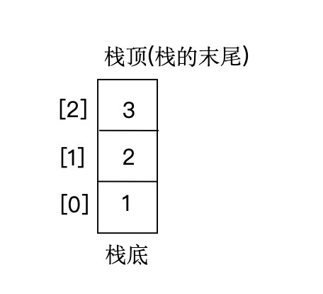
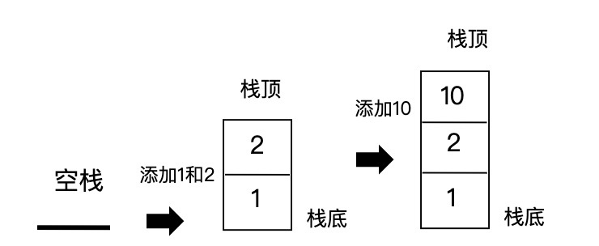

# 栈

## 栈的数据结构

栈是一种`后进前出`（LIFO）原则的有序集合（也就是说后面进来的先出去的意思）。添加或待删除的元素都保存在栈的同一端，叫作栈顶（栈的末尾），另一端叫做栈底。在栈里，新元素都靠近栈顶，旧元素都接近栈底。

在我们生活中也能看到栈的例子。比如：叠放的盘子、一摞书。


栈被用在编程语言的编译器和内存中保存变量、方法调用等，也被用到浏览器历史记录（浏览器的返回按钮）。

### 创建一个基于数组的栈

下面创建一个类来表示栈。

```js
class Stack {
  constructor() {
    this.items = [];
  }
}
```

我们需要保存一种数据结构来保存栈里的元素。可以选择数组（以上就是`items`）。数据允许我们在任何位置添加或删除元素。
栈是遵从`LIFO`原则，需要对元素的插入和删除功能进行限制。下面要给栈声明一些方法。

- `push()`：添加一个或者多个新元素到栈顶。
- `pop()`：移除栈顶的元素，同时返回被移除的元素。
- `peek()`：返回栈顶的元素，不对栈做任何修改（这个方法不会移除栈顶的元素，只是返回它而已）。
- `isEmpty`：如果栈里没有任何元素就返回`true`，否则返回`false`。
- `clear()`：清空栈里的所有元素。
- `size()`：返回栈里的元素个数。

#### 向栈添加元素

实现第一个方法就是`push`，这个方法负责向栈内添加元素，有一点很重要：这个方法只添加元素到栈顶，也就是栈的末尾。代码如下。

```js
push(ele) {
  this.items.push(ele);
}
```

因为是使用了数组来保存栈里的元素，所以用数组的`push`方法。

#### 从栈里移除元素

接着，来实现`pop`方法。这个方法用来移除栈里的元素。栈遵从`LIFO`原则，因此移出的是最后添加的元素。因此使用`pop`方法。

```js
pop() {
  return this.times.pop();
}
```

只能用`push`和`pop`方法添加和删除栈中元素，这样栈自然就遵从了`LIFO`原则。

#### 查看栈顶元素

如果想知道栈里最后添加的元素是什么，可以用`peek`方法。这个方法将返回栈顶的元素。

```js
peek() {
  return this.items[this.items.length - 1];
}
```

之所以要`length - 1`，因为访问最后一个元素用数组的长度减去`1`既可访问到数组的最后一个元素。



上面的图中，有一个数组，数组中包含了三个元素，数组的长度是`3`。最后一项的元素是`3`，而`length - 1（3-1）`正好是`2`。

#### 检查栈是否为空

这里实现的方法是`isEmpty`，如果栈为空的话就返回`true`，否则就返回`false`。

```js
isEmpty() {
  return this.items.length === 0;
}
```

使用`isEmpty`方法，就可以简单的判断数组的长度是否为`0`。

那么这样的话，我们就可以用数组的`length`属性获取数组中保存的元素有多少个了。下面实现`size`方法。

```js
size() {
  return this.items.length;
}
```

#### 清空栈元素

最后，来实现`clear`方法。`clear`方法是移除栈里的所有元素，把栈清空。最简单的方法如下。

```js
clear() {
  this.items = [];
}
```

这样就完成了栈的方法。

#### 使用 Stack 类

我们先来学习如何使用栈，首先初始化一个`Stack`类，然后查看栈是否为空。

```js
const stack = new Stack();
console.log(stack.isEmpty()); // true 为true就代表栈是空的
```

然后，向栈里添加元素。

```js
stack.push(1);
stack.push(2);

console.log(stack.peek()); // 2
```

这里添加了`1`和`2`，当然你可以添加任何类型的元素。然后调用了`peek`方法，输出的是`2`，因为它是栈里最后一个元素。

再往栈里添加一个元素。

```js
stack.push(10);
console.log(stack.size()); // 3
console.log(stack.isEmpty()); // false
```

我们往栈里添加了`10`。调用`size`方法，输出的是`3`，因为栈里有三个元素。如果调用`isEmpty`方法，输出的是`false`。
因为栈里有三个元素，不是空栈。

下面展示了到现在为止对栈的操作，以及栈的当前状态。


在调用`pop`方法之前，栈里有三个元素，调用两次后，现在栈只剩下`1`了。

下面展示上面所做的操作完整代码。

```js
class Stack {
  constructor() {
    this.items = [];
  }

  push(ele) {
    this.items.push(ele);
  }
  pop() {
    return this.items.pop();
  }
  peek() {
    return this.items[this.items.length - 1];
  }
  isEmpty() {
    return this.items.length === 0;
  }
  size() {
    return this.items.length;
  }
  clear() {
    this.items = [];
  }
}

const stack = new Stack();
console.log(stack.isEmpty()); // true

stack.push(1); // 向栈里添加了元素1
stack.push(2); // 向栈里添加了元素2

console.log(stack.peek()); // 此时栈里最后一个元素为2

stack.push(10); // 又往栈里添加一个元素10
console.log(stack.size()); // 这时栈的长度就变成了3
console.log(stack.isEmpty()); // false

stack.pop(); // 从栈顶中移除了一项
stack.pop(); // 从栈顶中又移除了一项
console.log(stack.size()); // 从栈中移除了两个元素，最后获取栈的长度就是1
```

## 创建一个基于 js 对象的`Stack`

创建一个`Stack`类最简单的方式就是使用一个数组来储存其元素。在处理大量的数组的时候，需要评估如何操作数据
是最高效的。在使用数组时，大部分方法的时间复杂度是`O(n)`。`O(n)`的意思就是，需要迭代整个数组直到找到的
那个元素，在最坏的情况下需要迭代数组的所有位置，其中的`n`代表数组的长度。如果数组有更多元素的话，所需的时
间就会更长。另外，数组是元素的一个有序集合，为了保证元素排序有序，它会占用更多的内存空间。

如果额能直接获取元素，占用较少的内存空间，并且仍然保证所有元素按照我们的需要排列，那不是更好吗？对于 js 语言
实现栈数据结构的场景，我们也可以用一个 js 对象来储存所有的栈元素，保证它们的顺序并且遵循`LIFO`原则。下面来
实现这样的行为。

首先声明一个`Stack`类。

```js
class Stack {
  constructor() {
    this.count = 0;
    this.items = {};
  }
}
```

这个版本的`Stack`类中，将使用一个`count`属性来帮助我们记录栈的大小（也能帮助我们从数据结构中添加和删除元素）。

#### 向栈中插入元素

在基于数组的版本中，我们可以同时向`Stack`类中添加多个元素。由于现在使用了一个对象，这个版本的`push`方法只允许
我们一次插入一个元素。下面展示`push`方法的代码。

```js
push(ele) {
  this.items[this.count] = ele;
  this.count++;
}
```

在 js 中，对象是一系列 **键值对** 的集合。要向栈中添加元素，我们将使用`count`变量作为`items`对象的键名，插入的
元素则是它的值。在向栈插入元素后，我们递增`count`变量。看下面的代码。

```js
const stack = new Stack();
stack.push(5);
stack.push(10);
console.log(stack);
// { count: 2, items: { '0': 5, '1': 10 } }
```

可以看到`Stack`类内部，`items`包含两个元素`5`和`10`，两个元素`key`则是`count`的值。`count`为`2`是因为在添加
元素之后才进行叠加的。

### 验证一个栈是否为空和它的大小

`count`属性也表示栈的大小。因此，可以简单的返回`count`属性的值来实现`size`方法。

```js
size() {
  return this.count;
}
```

要验证栈是否为空，可以判断`count`是否为`0`。

```js
isEmpty() {
  return this.count === 0;
}
```

### 从栈中弹出元素

由于我们没有使用数组来储存元素，需要手动实现移除元素的逻辑。`pop`方法一样是返回了从栈中移除的元素，看下面的代码。

```js
pop() {
  // 首先判断栈是否为空，如果为空，就返回undefined
  if (this.isEmpty()) {
    return undefined;
  }
  // 如果栈不为空的话，就将`count`属性减1
  this.count--;
  // result保存了栈顶的元素
  const result = this.items[this.count];
  // 删除栈顶的元素
  delete this.items[this.count];
  // 之后返回刚才保存的栈顶元素
  return result;
}
```

#### 查看栈顶的值并将栈清空

要访问栈顶元素，需要把`count`属性减`1`。代码如下。

```js
peek() {
  if (this.isEmpty()) {
    return undefined;
  }
  this.items[this.count - 1];
}
```

下面是清空栈的方法，只需要把它的值设置为初始化时候的值就行了。

```js
clear() {
  this.items = {};
  this.count = 0;
}
```

当然也可以像下面这样移除栈里的所有元素。

```js
anotherClear() {
  while (!this.isEmpty()) {
    this.pop();
  }
}
```

### 创建 toString 方法

在数组的版本中，并不需要关心`toString`方法的实现，因为数据结构可以直接使用数组本身的`toString`方法。
对于使用对象的版本，将创建一个`toString`方法来像数组一样打印出栈的内容。

```js
toString() {
  // 如果栈为空，将返回一个空字符串。
  if (this.isEmpty()) {
    return "";
  }

  // 如果栈不为空，就需要用它底部的第一个元素作为字符串的初始值
  let objString = `${this.items[0]}`;
  // 如果栈只包含一个元素，就不会执行`for`循环。
  for (let i = 1; i < this.count; i++) {
    // 迭代整个栈的键，一直到栈顶，添加一个逗号（,）以及下一个元素。
    objString = `${objString},${this.items[i]}`;
  }
  return objString;
}
```

这样就完成了两个版本的`Stack`类。这也是一个用不同方式写代码的例子。对于使用`Stack`类，选择使用基于数组还是基于
对象的版本来说并不重要，两种方法都提供一样的方法，只是内部实现就不一样。下面是基于对象的版本所有代码。

```js
class Stack {
  constructor() {
    this.count = 0;
    this.items = {};
  }

  push(ele) {
    this.items[this.count] = ele;
    this.count++;
  }

  size() {
    return this.count;
  }

  isEmpty() {
    return this.count === 0;
  }

  pop() {
    // 首先判断栈是否为空，如果为空，就返回undefined
    if (this.isEmpty()) {
      return undefined;
    }
    // 如果栈不为空的话，就将`count`属性减1
    this.count--;
    // result保存了栈顶的元素
    const result = this.items[this.count];
    // 这里是删除栈顶的元素，由于使用的是对象，所以可以使用delete运算符从对象中删除一个特定的值
    delete this.items[this.count];
    // 之后返回栈顶的元素
    return result;
  }

  peek() {
    if (this.isEmpty()) {
      return undefined;
    }
    this.items[this.count - 1];
  }

  clear() {
    this.items = {};
    this.count = 0;
  }

  anotherClear() {
    while (!this.isEmpty()) {
      this.pop();
    }
  }

  toString() {
    // 如果栈为空，将返回一个空字符串。
    if (this.isEmpty()) {
      return "";
    }

    // 如果栈不为空，就需要用它底部的第一个元素作为字符串的初始值
    let objString = `${this.items[0]}`;
    // 如果栈只包含一个元素，就不会执行`for`循环。
    for (let i = 1; i < this.count; i++) {
      // 迭代整个栈的键，一直到栈顶，添加一个逗号（,）以及下一个元素。
      objString = `${objString},${this.items[i]}`;
    }
    return objString;
  }
}
```

## 保护数据结构内部元素

在多人开发情况下，在创建别的开发者也可以使用的数据结构或对象的时候，希望保护内部的元素，只有
暴露出来的方法才能修改内部结构。对于`Stack`类来说，要确保元素只会被添加到栈顶，而不是栈底或者
栈的其他位置。但是在`Stack`类中声明的`items`和`count`属性并没有得到保护，因为 js 的类就是这样
工作的。

来看下面的代码。

```js
const stack = new Stack();
console.log(Object.getOwnPropertyNames(stack)); // [ 'count', 'items' ]
console.log(Object.keys(stack)); // [ 'count', 'items' ]
console.log(stack.items); // {}
```

上面的代码中，前两个`log`输出结果是`[ 'count', 'items' ]`。这就表示`count`和`items`属性是
公开的，可以像第三个`log`那样直接访问它们。这样的话，我们就可以随便给这两个属性赋新的值了。这样就
严重破坏了这些数据。下面来看看其他使用 js 来实现私有属性的方法。

### 下划线命名

一部分开发人员喜欢在 js 里使用下划线命名来标记一个属性为私有属性。

```js
class Stack {
  constructor() {
    this._count = 0;
    this._items = {};
  }
}
```

下划线命名只是在属性名前加一个下划线（\_）。这种方式只是一种约定，并不能保护数据。而且只能依赖于使用代码
的开发人员具备的常识。

### 用 ES6 的限定作用域 Symbol 实现类

ES6 新增了一个叫做`Symbol`的基本类型，它表示独一无二的，可以用作对象的属性。看看怎么使用它在`Stack`类中
声明`items`属性。

```js
const _items = Symbol("stackItems");
class Stack {
  constructor() {
    this[_items] = [];
  }
}
```

在上面的代码中，声明了`Symbol`类型的变量`_items`，在类的`constructor`函数中初始化它的值。要访问`_items`，
必须把所有的`this.items`替换成`this[_items]`。

这种方法创建了一个假的私有属性，因为 ES6 新增了一个`Object.getOwnPropertySymbols`方法能够取得类里面声明的所
有`Symbols`属性。下面是一个破坏`Stack`类的例子。

```js
const stack = new Stack();
stack.push(5);
stack.push(8);
let objSymbols = Object.getOwnPropertySymbols(stack);
console.log(objSymbols.length); // 1
console.log(objSymbols); // [ Symbol(stackItems) ]
console.log(objSymbols[0]); // Symbol(stackItems)
stack[objSymbols[0]].push(1);
console.log(stack[_items]); // [ 5, 8, 1 ]
```

从上面的代码来看，访问`stack[objSymbols[0]]`可以得到`_items`。而且，`_items`属性是一个数组，可以进行任意
的数组操作，比如从中间删除或添加元素。但是现在操作的是栈，所以不应该出现这种行为。

### 用 ES6 的 WeakMap 实现类

`WeakMap`可以确保属性是私有的，`WeakMap`可以储存键值对，其中键是对象，值可以是任意数据类型。

使用`WeakMap`来存储`items`属性，看下面的代码。

```js
const items = new WeakMap();

class Stack {
  constructor() {
    items.set(this, []);
  }

  push(ele) {
    const s = items.get(this);
    s.push(ele);
  }

  pop() {
    const s = items.get(this);
    const r = s.pop();
  }
}
```

上面代码中，声明一个 WeakMap 类型的变量 items。在`constructor`中，以`this`（`Stack`类自己的引用）为键，把代表
栈的数组存入`items`。在`push`方法中，从`WeakMap`中取出值，即以`this`为键从`items`中取值。

现在知道了，`items`在`Stack`类里是真正的私有属性。但是采用这种方法，代码可读性不强，而且在扩展该类时无法继承私有
属性。

## 用栈解决问题

栈的实际应用非常广泛。在回溯问题中，它可以存储访问过的任何或路径、撤销的操作。

### 从十进制到二进制
在生活中，我们主要使用十进制。但在计算机科学中，二进制非常重要，因为计算机的所有内容都是用二进制数字表示的（`0`和`1`）。

要把十进制转成二进制，可以将该十进制数除以`2`（二进制是满二进一）并对商取整，直到结果是`0`为止。举个例子，把十进制的数`10`转成二进制的数字，下面是对应的算法。
```js
function decimal(num) {
  const remStack = []; // 存储二进制的栈
  let number = num; // 需要转成二进制的数
  let rem = ""; // 余数
  let binaryString = ""; // 存储推出栈的元素

  // 当参数不为0时，进入while语句
  while (number > 0) {
    rem = Math.floor(number % 2);
    remStack.push(rem); // 把余数添加到remStack数组中
    number = Math.floor(number / 2); // number除以2，得到下次要取余数的值，此时的number的值已经不是传入的参数了。
  }

  while (remStack.length !== 0) {
    // 用pop方法把栈中的元素移除，将移除栈的元素连成字符串
    binaryString += remStack.pop().toString();
  }
  return binaryString;
}

console.log(decimal(10)); // 1010
console.log(decimal(100)); // 1100100
```
在上面这段代码里，当参数不是`0`时，进入`while`语句。就得到一个余数赋值给`rem`，并放入栈里。然后让`number`除以`2`，就得到了下次进入`while语句`取余数的值。要注意的是，此时的`number`的值已经不是传入参数的值了。最后，用`pop`方法把栈中的元素移除，将移除的元素连成字符串。

### 进制转换算法
修改之前的算法，可以将十进制转成计数为`2~36`的任何进制。除了把十进制除以`2`转成二进制数外，还可以传入其他任何禁止的基数为参数。
```js
function baseConverter(num, base) {
  const remStack = [];
  const digits = "0123456789ABCDEFGHIJKLMNOPQRSTUVWXYZ";
  let number = num;
  let rem = "";
  let baseString = "";

  if (!(base >= 2 && base <= 36)) {
    return '';
  }

  while (number > 0) {
    rem = Math.floor(number % base);
    remStack.push(rem);
    number = Math.floor(number / base);
  }
  
  while (remStack.length !== 0) {
    baseString += digits[remStack.pop()];
  }
  return baseString;
}

console.log(baseConverter(10000, 2)); // 10011100010000
console.log(baseConverter(10000, 8)); // 23420
console.log(baseConverter(10000, 16)); // 64
console.log(baseConverter(10000, 36)); // 7PS
```
上面的代码只需要改一个地方，把十进制转成二进制的时候，余数是`0`和`1`，再把十进制转八进制的时候，余数是`0~7`；但是把十进制转十六进制时，余数是`0~9`再加上`A、B、C、D、E、F`（对应10、11、12、13、14、15）。所以需要对栈中的数组做一个转换才行（`baseString += digits[remStack.pop()]`这段代码）。从十一进制开始，字母表中的每个字母都对应一个基数，`A`就代表基数`11`，`B`就代表基数`12`，以此类推。
