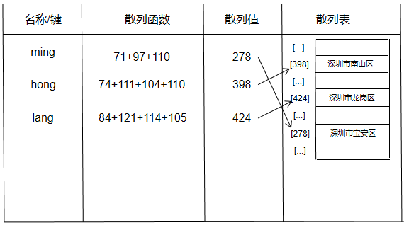
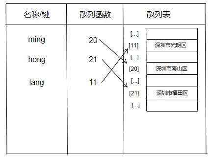

# 字典和散列表

现在已经知道集合是一组不可重复的元素。在字典中，存储的是`[键，值]`对，键名是用来查询特定元素的。字典和集合很相似，集合是以`[值，值]`的形式存储元素，而字典是以`[键，值]`的形式来存储元素。字典也叫做**映射、符号表**或**关联数组**。

在计算机中，字典常用于保存对象的引用地址。例如，打开谷歌浏览器开发者工具中的**Memory**标签页，执行快照功能，就可以看到内存中的一些对象和它们对应的地址（@<数>表示）。看下面的截图。


## 创建字典类

ES6 中增加了`Map`数据结构，也就是我们所说的字典。没有学过`Map`数据结构的同学可以去看看阮一峰老师的 ES6。

这里实现的类就以 ES6 中的`Map`类的实现为基础，它和`Set`类很相似，不同之处在于存储元素的形式不一样。

以下是`Dictionary`的骨架。

```js
class Dictionary {
  constructor(toStrFn = defaultToString) {
    this.toStrFn = toStrFn;
    this.table = {};
  }
}
```

和`Set`类类似，用一个`Object`的实例存储字典中的元素（`table`属性）。我们会将`[键，值]`对保存为`table[key] = {key, value}`。

:::tip
使用方括号（[]）获取对象的属性 ，把属性名作为“**位置**”传入即可。这也是称它为关联数组的原因。
:::

```js
function defaultToString(item) {
  if (item === null) {
    return "NULL";
  } else if (item === undefined) {
    return "UNDEFINED";
  } else if (typeof item === "string" || item instanceof String) {
    return `${item}`;
  }
  return item.toString();
}
```

在字典中，最好是用字符串作为键名，值可以是任何类型。但是，js 不是强类型的语言，我们不能保证键一定是字符串。我们需要把所有作为键名的对象转为字符串，这样从`Dictionary`类中搜索和获取值更简单。要实现这个功能，就需要一个将`key`转为字符串的函数（也就是`defaultToString()`）。

:::warning
要注意的是，如果`item`变量是一个对象的话，就需要实现`toString`方法，否则会导致出现`[object Object]`这种异常输出的情况。
:::

如果键是一个字符串，就直接返回它，否则要调用`item`的`toString`方法。

下面声明一些映射/字典所能使用的方法。

- `set(key, value)`：向字典中添加新元素，如果`key`已存在，就把已存在的`value`覆盖掉。
- `remove(key)`：通过使用键值作为参数来从字典中移除键值对应的数据值。
- `hasKey(key)`：如果某个键值存在该字典中，返回`true`，否则返回`false`。
- `get(key)`：通过键值作为参数查找特定的数值并且返回。
- `clear()`：删除字典中的所有值。
- `size()`：返回字典所包含值的数量。与数组的`length`属性类似。
- `isEmpty()`：在`size`等于`0`的时候返回`true`，否则返回`false`。
- `keys()`：把字典所包含的所有数值以数组形式返回。
- `keyValues()`：把字典中所有`[键，值]`对返回。
- `forEach(callbackFn)`迭代字典中所有的键值对。`callbackFn`有两个参数：`key`和`value`这个方法可以在回调函数返回`false`的时候被中止（和数组中的`every`方法相似）。

### hasKey 方法

先来实现`hasKey(key)`方法，该方法用于检查一个键是否存在字典中。

```js
hasKey(key) {
  return this.table[this.toStrFn(key)] != null;
}
```

js 只允许我们使用字符串作为对象的键名或属性名。如果传入一个复杂对象作为键，需要把它转为一个字符串。因此需要调用`toStrFn`函数。如果已经存在一个给定键名的键值对（表中的位置不是`null`或`undefined`），就返回`true`，否则返回`false`。

### set 方法

下面来实现`set`方法，该方法用于设置字典中的键和值。

```js
set(key, val) {
  if (key != null && value != null) {
    const tableKey = this.toStrFn(key);
    this.table[tableKey] = new ValuePair(key, val);
    return true;
  }
  return false;
}
```

该方法接收`key`和`value`作为参数。如果`key`和`value`不是`undefined`或`null`，就获取表示`key`的字符串，创建一个新的键值对并把它赋值给`table`对象上的`key`属性。如果`key`和`value`合法，就返回`true`，表示字典可以把`key`和`value`保存下来，否则返回`false`。

该方法可以用于添加新的值和更新已有的值。

在`set`方法中实例化了一个`ValuePair`类。`ValuePair`定义如下。

```js
class ValuePair {
  constructor(key, value) {
    this.key = key;
    this.value = value;
  }

  toString() {
    return `[#${this.key}: ${this.value}]`;
  }
}
```

为了在字典中保存`value`，把`key`转成了字符串，而为了保存信息的需要，同样要保存原始的`key`。因此，不是只把`value`保存在字典中，而是要保存两个值：原始的`key`和`value`。为了字典能更简单地通过`toString`方法输出结果，同样要为`ValuePair`类创建`toString`方法。

### remove 方法

接下来，实现`remove`方法，该方法用于从字典中移除一个值。它跟`Set`类中的`delete`方法很相似，唯一的不同是用`key`搜索（而不是`value`）。

```js
remove(key) {
  if (this.hasKey(key)) {
    delete this.table[this.toStrFn(key)];
    return true;
  }
  return false;
}
```

### get 方法

如果要从字典中查询一个特定的`key`，并获取它的`value`，可以使用`get`方法。

```js
get(key) {
  const valuePair = this.table[this.toStrFn(key)];
  return valuePair == null ? undefined : valuePair.value;
}
```

`get`方法首先检索存储在给定`key`属性中对象。如果`valuePair`对象存在，就返回该值，否则返回一个`undefined`。

### valuePairs 方法

首先是`valuePair`方法，该方法用于获取字典中所有`valuePair`的值，以数组形式返回。下面有两个版本。

```js
keyValues() {
  return Object.values(this.table);
}

otherKeyValues() {
  const valuePairs = [];
  for (let k in this.table) {
    if (this.hasKey(k)) {
      valuePairs.push(this.table[k]);
    }
  }
  return valuePairs;
}
```

第一个版本简单的用了`Object`内置的`values`方法。第二个版考虑到可能有些浏览器不支持`Object.values`方法，实现和之前讲的`Set`集合类中的`valuesLegacy`方法性质一样。

### keys 方法

下面是`keys`方法，该方法返回字典中的所有原始键名。有两个版本。

```js
keys() {
  return this.keyValues().map((valuePair) => valuePair.key);
}
```

这里调用了`keyValues`方法，返回一个包含`valuePair`实例的数组，然后迭代每个`valuePair`。由于我们只想要`valuePair`的`key`，所以就只返回它的`key`。

`keys`方法的第二个版本。

```js
anotherKeys() {
  const keys = [];
  const valuePair = this.keyValues().length;
  for (let i = 0; i < valuePair.length; i++) {
    keys.push(valuePair[i].key);
  }
  return keys;
}
```

### values 方法

跟`keys`方法相似，还有一个`values`方法。`values`方法返回一个字典中的所有值，并以数组的形式返回。它的代码跟`keys`方法相似，只不过返回的是`ValuePair`类的`value`属性。

```js
values() {
  return this.keyValues().map((valuePair) => valuePair.value);
}
```

#### 用`forEach`迭代字典中的每个键值对

```js
forEach(callbackFn) {
  const valuePairs = this.keyValues();
  for (let i = 0; i < valuePairs.length; i++) {
    const result = callbackFn(valuePairs[i].key, valuePairs[i].value);

    if (result === false) {
      break;
    }
  }
}
```

首先，获取字典中所有`ValuePairs`构成的数组，然后迭代每个`valuePair`并执行以参数形式传入`forEach`方法的`callbackFn`函数，保存它的结果。如果回调函数返回了`false`，就中断`forEach`方法的执行，打断正在迭代`valuePairs`的`for`循环。

### clear、size、isEmpty 和 toString 方法

`size`方法返回字典中的值的个数。可以用`Object.keys`方法获取`table`对象中的所有键名。也可以调用`keyValues`方法并返回它所返回的数组长度。

```js
size() {
  return Object.keys(this.table).length;
}

anotherSize() {
  return this.keyValues().length;
}
```

要检查字典是否为空，直接获取它的`size`看看是否为零就可以了。

```js
isEmpty() {
  return this.size() === 0;
}
```

要清空字典内容，直接把一个新对象赋值给`table`就行了。

```js
clear() {
  this.table = {};
}
```

最后来实现`toString`方法。

```js
toString() {
  if (this.isEmpty()) {
    return "";
  }

  const valuePairs = this.keyValues();
  let objString = `${valuePairs[0].toString()}`;
  for (let i = 0; i < valuePairs.length; i++) {
    objString = `${objString}, ${valuePairs[i].toString()}`;
  }
  return objString;
}
```

`toString`方法的实现其实和之前所讲过的数据结构的`toString`方法并没有什么差异。

### 使用 Dictionary 类

下面用`Dictionary`类实现一个地址目录。

```js
const dictionary = new Dictionary();

dictionary.set("ming", "深圳市宝安区");
dictionary.set("hong", "深圳市南山区");
dictionary.set("lang", "深圳市龙岗区");

console.log(dictionary.hasKey("hong"));
// true

console.log(dictionary.size());
// 3

console.log(dictionary.keys());
// [ 'ming', 'hong', 'lang' ]

console.log(dictionary.values());
// [ '深圳市宝安区', '深圳市南山区', '深圳市龙岗区' ]

console.log(dictionary.get("hong"));
// 深圳市南山区

// 移除一个元素
dictionary.remove("ming");

console.log(dictionary.keyValues());
// [
//   { key: "hong", value: "深圳市南山区" },
//   { key: "lang", value: "深圳市龙岗区" },
// ];

dictionary.forEach((key, val) => {
  console.log(`key: ${key},  value: ${val}`);
});
// key: hong,  value: 深圳市南山区
// key: lang,  value: 深圳市龙岗区
```

### Dictionary 整体代码

```js
function defaultToString(item) {
  if (item === null) {
    return "NULL";
  } else if (item === undefined) {
    return "UNDEFINED";
  } else if (typeof item === "string" || item instanceof String) {
    return `${item}`;
  }
  return item.toString();
}

class ValuePair {
  constructor(key, value) {
    this.key = key;
    this.value = value;
  }

  toString() {
    return `[#${this.key}: ${this.value}]`;
  }
}

class Dictionary {
  constructor(toStrFn = defaultToString) {
    this.toStrFn = toStrFn;
    this.table = {};
  }

  hasKey(key) {
    return this.table[this.toStrFn(key)] != null;
  }

  set(key, val) {
    if (key != null && val != null) {
      const tableKey = this.toStrFn(key);
      this.table[tableKey] = new ValuePair(key, val);
      return true;
    }
    return false;
  }

  remove(key) {
    if (this.hasKey(key)) {
      delete this.table[this.toStrFn(key)];
      return true;
    }
    return false;
  }

  get(key) {
    const valuePair = this.table[this.toStrFn(key)];
    return valuePair == null ? undefined : valuePair.value;
  }

  keyValues() {
    return Object.values(this.table);
  }

  anotherKeyValues() {
    const valuePairs = [];
    for (let k in this.table) {
      if (this.hasKey(k)) {
        valuePairs.push(this.table[k]);
      }
    }
    return valuePairs;
  }

  keys() {
    return this.keyValues().map((valuePair) => valuePair.key);
  }

  anotherKeys() {
    const keys = [];
    const valuePair = this.keyValues().length;
    for (let i = 0; i < valuePair.length; i++) {
      keys.push(valuePair[i].key);
    }
    return keys;
  }

  values() {
    return this.keyValues().map((valuePair) => valuePair.value);
  }

  forEach(callbackFn) {
    const valuePairs = this.keyValues();
    for (let i = 0; i < valuePairs.length; i++) {
      const result = callbackFn(valuePairs[i].key, valuePairs[i].value);

      if (result === false) {
        break;
      }
    }
  }

  size() {
    return Object.keys(this.table).length;
  }

  anotherSize() {
    return this.keyValues().length;
  }

  isEmpty() {
    return this.size() === 0;
  }

  clear() {
    this.table = {};
  }

  toString() {
    if (this.isEmpty()) {
      return "";
    }

    const valuePairs = this.keyValues();
    let objString = `${valuePairs[0].toString()}`;
    for (let i = 0; i < valuePairs.length; i++) {
      objString = `${objString}, ${valuePairs[i].toString()}`;
    }
    return objString;
  }
}
```

## 散列表

散列算法（散列也称哈希）的用处是尽快在数据结构中找到一个值。例如，在数组中要找到一个值，就需要迭代整个数组来找到它。如果用散列函数，就知道值的具体位置，这样就能快速找到这个值。散列函数的作用是给定一个键值，然后返回值在表中的地址。

散列表有一些在计算机中应用的例子。因为它是字典的一种实现，所以可以用作关联数组。它也可以用来对数据库进行索引。另一个常见的应用是使用散列表来表示对象。js 语言内部就是用散列表来表示每个对象。对象的每个属性和方法都被存储为`key`对象类型，每个`key`指向对应的对象成员。

就用地址簿为例，最常见的散列函数—— **lose lose** 散列函数，方法是简单把每个键值中的每个字母的 **ASCII** 值相加，看下面的图。


### 创建散列表

下面将使用一个关联数组来表示散列表的数据结构，和`Dictionary`类的做法一样。

```js
function defaultToString(item) {
  if (item === null) {
    return "NULL";
  } else if (item === undefined) {
    return "UNDEFINED";
  } else if (typeof item === "string" || item instanceof String) {
    return `${item}`;
  }
  return item.toString();
}

class HashTable {
  constructor(toStrFn = defaultToString) {
    this.toStrFn = toStrFn;
    this.table = {};
  }
}
```

然后给类添加一些方法。

- `put(key, value)`：向散列表增加一个新的项。也可以用于更新散列表。
- `remove(key)`：根据键值从散列表中移除值。
- `get(key)`：返回根据键值检索到的特定的值。

在此之前，还要实现一个散列函数，它的用处是把任意长度的输入变换成固定长度输出。该输出就是散列值，看下面的代码。

```js
loseHashCode(key) {
  if (typeof key === "number") {
    return key;
  }
  // 把key转换成字符串
  const tableKey = this.toStrFn(key);
  // 字符串数值总和的哈希值
  let hash = 0;
  // 使用字符串的长度将每个字符转成数值
  for (let i = 0; i < tableKey.length; i++) {
    hash += tableKey.charCodeAt(i);
  }
  return hash % 37;
}

hashCode(key) {
  return this.loseHashCode(key);
}
```

`hashCode`方法用于只是简单的调用了`loseHashCode`方法，把`key`作为参数传给`loseHashCode`方法。

我们来分析一个`loseHashCode`函数，首先检查传入的`key`是不是一个数。如果是，就直接返回`key`。然后，用`key`的每个字符的**ASCII**码值的和得到一个数。要完成这一步，首先把`key`转换成一个字符串，防止`key`是一个对象而不是字符串。还需要一个`hash`变量来存储这个总和，可以用`charCodeAt`方法。最后，返回`hash`值。这样做是为了得到比较小的数值，使用`hash`值和一个任意数做除法的余数。从而可以避免操作数超过变量最大表示范围的风险。

### put 方法

下面来实现`put`方法，该方法用于将键和值添加到散列表中。

```js
put(key, value) {
  if (key != null && value != null) {
    const position = this.hashCode(key);
    this.table[position] = new ValuePair(key, value);
    return true;
  }
  return false;
}
```

`put`方法和`Dictionary`类里的`set`方法逻辑相似。也可以把它命名为`set`，但是在大部分编程语言会在`HashTable`数据结构中使用`put`方法，因此遵循相同的命名方式。

### get 方法

从`HashTable`实例中获取一个值和`Dictionary`里的`get`相似。

```js
get(key) {
  const valuePair = this.table[this.hashCode(key)];
  return valuePair == null ? undefined : valuePair.value;
}
```

不同之处就在于`Dictionary`类中，把`valuePair`保存在`table`的`key`属性中，而`HashTable`类中，是由`key`生成一个数，并把`valuePair`保存在`hash`位置。

### remove 方法

最后一个`remove`方法，看单词就知道它是移除一个值。

```js
remove(key) {
  // 获取hash值
  const hash = this.hashCode(key);
  // 通过hash值获取valuePair
  const valuePair = this.table[hash];
  if (valuePair != null) {
    delete this.table[hash];
    return true;
  }
  return false;
}
```

### 使用 HashTable 类

下面来测试一下`HashTable`类。

```js
const hashTable = new HashTable();
hashTable.put("ming", "深圳市南山区");
hashTable.put("hong", "深圳市福田区");
hashTable.put("lang", "深圳市光明区");

console.log(hashTable.hashCode("ming"), "ming"); // 20 ming
console.log(hashTable.hashCode("hong"), "hong"); // 21 hong
console.log(hashTable.hashCode("lang"), "lang"); // 11 lang

// 获取hong
console.log(hashTable.get("hong")); // 深圳市福田区

// 获取huang，由于huang不存在，所以返回undefined
console.log(hashTable.get("huang")); // undefined

// 移除了lang
hashTable.remove("lang");
console.log(hashTable.get("lang")); // undefined
```

下面展示上面三个元素在`HashTable`数据结构的图。



### HashTable 类整体代码

```js
class HashTable {
  constructor(toStrFn = defaultToString) {
    this.toStrFn = toStrFn;
    this.table = {};
  }

  // 生成散列值的函数
  loseHashCode(key) {
    if (typeof key === "number") {
      return key;
    }
    // 把key转换成字符串
    const tableKey = this.toStrFn(key);
    // 字符串数值总和的哈希值
    let hash = 0;
    // 使用字符串的长度将每个字符转成数值
    for (let i = 0; i < tableKey.length; i++) {
      hash += tableKey.charCodeAt(i);
    }
    return hash % 37;
  }

  hashCode(key) {
    return this.loseHashCode(key);
  }

  put(key, value) {
    if (key != null && value != null) {
      const position = this.hashCode(key);
      this.table[position] = new ValuePair(key, value);
      return true;
    }
    return false;
  }

  get(key) {
    const valuePair = this.table[this.hashCode(key)];
    return valuePair == null ? undefined : valuePair.value;
  }

  remove(key) {
    const hash = this.hashCode(key);
    const valuePair = this.table[hash];
    if (valuePair != null) {
      delete this.table[hash];
      return true;
    }
    return false;
  }

  getTable() {
    return this.table;
  }

  isEmpty() {
    return this.size() === 0;
  }

  size() {
    return Object.keys(this.table).length;
  }

  clear() {
    this.table = {};
  }

  toString() {
    if (this.isEmpty()) {
      return "";
    }

    const keys = Object.keys(this.table);
    let objString = `${keys[0]} => ${this.table[keys[0]].toString()}`;
    for (let i = 1; i < keys.length; i++) {
      objString = `${objString}, ${keys[i]} => ${this.table[
        keys[i]
      ].toString()}`;
    }
    return objString;
  }
}
```

### 处理散列表中的冲突

有时候，一些键会有相同的散列值。不同的值在散列表中对应相同的位置的时候，称为冲突。

```js
const hash = new HashTable();
hashTable.put("Ygritte", "深圳市光明区");
hashTable.put("Jonathan", "深圳市宝安区");
hashTable.put("Jamie", "深圳市龙岗区");
hashTable.put("Jack", "深圳市南山区");
hashTable.put("Jasmine", "深圳市罗湖区");
hashTable.put("Jake", "深圳市福田区");
hashTable.put("Nathan", "深圳市光明新区");
hashTable.put("Athelstan", "深圳市盐田区");
hashTable.put("Sargeras", "深圳市坪山区");

console.log(hashTable.hashCode("Ygritte"), "Ygritte");
console.log(hashTable.hashCode("Jonathan"), "Jonathan");
console.log(hashTable.hashCode("Jamie"), "Jamie");
console.log(hashTable.hashCode("Jack"), "Jack");
console.log(hashTable.hashCode("Jasmine"), "Jasmine");
console.log(hashTable.hashCode("Jake"), "Jake");
console.log(hashTable.hashCode("Nathan"), "Nathan");
console.log(hashTable.hashCode("Athelstan"), "Athelstan");
console.log(hashTable.hashCode("Sargeras"), "Sargeras");
// 4 Ygritte
// 5 Jonathan
// 5 Jamie
// 7 Jack
// 8 Jasmine
// 9 Jake
// 10 Nathan
// 7 Athelstan
// 10 Sargeras
```

注意，Jonathan 和 Jamie 有相同的散列值`10`。Jack 和 Athelstan 有相同的散列值`7`，Jonathan 和 Jamie 有相同的散列值`5`。

我们可以调用`console.log(hashTable.toString())`后，控制台中会输出下面的结果。

```js
console.log(hashTable.toString());
// 4 => [#Ygritte: 深圳市光明区],
// 5 => [#Jamie: 深圳市龙岗区],
// 7 => [#Athelstan: 深圳市盐田区],
// 8 => [#Jasmine: 深圳市罗湖区],
// 9 => [#Jake: 深圳市福田区],
// 10 => [#Sargeras: 深圳市坪山区]
```

如果是相同的散列值，就会被后面相同的散列值覆盖掉。就拿散列值为`5`的两个元素来说。首先，添加的是`Jonathan`，然后再添加`Jamie`。就导致`Jamie`覆盖了`Jonathan`的值。这对于其他发生冲突的元素来说也是一样的。

在使用一个数据结构来保存数据的目的不是丢失这些数据，而是通过某种方法把它们全部保存起来。因此，当出现这种情况的时候就要去解决。处理冲突有几种方法：分离链接、线性探查和双散列法。这里就讲前面的两种。

#### 分离链接

**分离链接**法就是为散列表的每个位置创建一个链表并且把元素存储在里面。它是解决冲突的最简单的方法，但是除了`HashTable`实例之外还需要用链表数据结构来存储元素。

例如，之前的测试代码中使用分离链表用图表示的话，结果如下。


在位置`5`、`7`和`10`，都包含了两个元素的链表实例。而在位置`4`、`8`和`9`上，只包含单个元素的链表实例。

对于分离链接和线性探查来说，只需要重写`put`、`get`和`remove`这三个方法。这三个方法在每种技术实现中都有不同。

首先，声明`HashTableSeparateChaining`的基本结构。

```js
class HashTableSeparateChaining {
  constructor(toStrFn = defaultToString) {
    this.toStrFn = toStrFn;
    this.table = {};
  }
}
```

#### put 方法

先来实现`put`方法。

```js
put(key, val) {
  if (key != null && val != null) {
    const position = this.hashCode(key);
    // 验证加入新元素是否被占据
    if (this.table[position] == null) {
      this.table[position] = new LinkedList();
    }
    this.table[position].push(new ValuePair(key, value));
    return true;
  }
  return false;
}
```

在这个方法中，先验证要添加的新元素的位置是否为第一次添加。如果是第一次向该位置加入元素，就在该位置上初始化一个`LinkedList`类的实例。然后用`LinkedList`实例中的`push`方法添加一个`ValuePair`实例。

#### get 方法

下面来实现`get`方法，用于获取给定键的值。

```js
get(key) {
  const position = this.hashCode(key); // 转换成哈希值
  const linkedList = this.table[position]; // 获取链表
  // 检查该位置的链表是否有效
  if (linkedList != null && !linkedList.isEmpty()) {
    // 获取链表头部的引用
    let current = linkedList.getHead();
    // 从头到位迭代链表，找到指定key
    while (current != null) {
      if (current.element.key === key) {
        return current.element.value;
      }
      current = current.next;
    }
  }
  return undefined;
}
```

#### remove 方法

这里的 remove 方法和之前的 remove 方法有所不同。因为现在用的是链表，所以需要从链表中移除一个元素。

```js
remove(key) {
  const position = this.hashCode(key); // 转换成哈希值
  const linkedList = this.table[position]; // 获取链表
  // 检查该位置的链表是否有效
  if (linkedList != null && !linkedList.isEmpty()) {
    let current = linkedList.getHead();
    // 从头开始迭代链表，找到指定的key
    while (current != null) {
      if (current.element.key === key) {
        // 如果链表中的元素是想要找到的元素，就从链表中移除
        linkedList.remove(current.element);

        // 如果是链表为空，就从散列表中删除该位置
        if (linkedList.isEmpty()) {
          delete this.table[position];
        }
        return true;
      }
      current = current.next;
    }
  }
  return false;
}
```

#### 线性探查

还有一种解决冲突的方法是线性探索。之所以叫做线性，是因为它处理冲突的方法是将元素直接存储到表中，而不是像分离链接那样要使用链表。

当想向表中某个位置添加一个新元素时，如果索引`position`的位置已经被占了，就尝试`position + 1`的位置。如果`position + 1`的位置也被占了，就尝试`position + 2`的位置，以此类推，直到在散列表中找到一个空闲的位置。

假设，有一个非空的散列表，想要添加一个新的键和值。计算这个新建的`hash`，并且检查散列表中对应的位置是否被占。如果没有，就把该值添加到正确的位置。如果被占了，就迭代散列表，找到一个空闲的位置。
