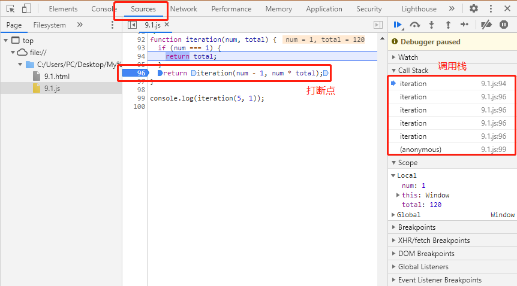

# 递归

## 什么是递归

首先来举个例子：

> 从前有座山，山里有座庙，庙里有个老和尚，正在给小和尚讲故事呢！故事是什么呢？"从前有座山，山里有座庙，庙里有个老和尚，正在给小和尚讲故事呢！故事是什么呢？'从前有座山，山里有座庙，庙里有个老和尚，正在给小和尚讲故事呢！故事是什么呢？……'"

> 要理解什么是递归，首先要理解什么递归。

递归是一种解决问题的方法，它从解决问题的各个小部分开始，直到解决最初的大问题。

在计算机中，在函数中通过调用函数自身就叫递归。来看个例子。

```js
function recursion(res) {
  recursion(res);
}
```

像下面这样间接调用函数自身的函数，也是一个递归。

```js
function recursion1() {
  recursion2();
}

function recursion2() {
  recursion1();
}
```

那么执行`recursion`的结果又会怎么样呢？就拿上面的两个例子来说，它会进入一个死循环。因此，每个递归函数必须要有一个终止递归的条件。

在理解什么是递归后，也就解决了最开始的问题。

```js
function recursion1() {
  const answer = getAnswer("你理解递归了吗？");

  if (answer === true) {
    // 终止递归的条件
    return true;
  }

  recursion1(); // 递归调用
}
```

`recursion1`函数不断调用自己，只有`answer`的值为`true`时。返回了`true`，也退出了递归调用。

有了基本的了解之后，来看看计算机中有哪些著名的递归算法。

## 数的阶乘

下面来看看如何计算一个数的阶乘。数`n`的阶乘，表示从`1`到`n`的整数的乘积。`5`的阶乘表示为`5`，和`5 x 4 x 3 x 2 x 1`相同，结果为`120`。

### 迭代阶乘

使用一个循环来写计算一个数阶乘的函数，看下面代码。

```js
function iteration(num) {
  if (num < 0) return undefined;
  let total = 1;
  for (let n = num; n > 1; n--) {
    total = total * n;
  }
  return total;
}

console.log(iteration(5)); // 120
```

### 递归阶乘

我们来用递归重写`iteration`函数。`5`的阶乘用`5 x 4 x 3 x 2 x 1`。`4(n - 1)`的阶乘是用`4 x 3 x 2 x 1`来计算。计算`n - 1`的阶乘
是计算原始问题`n!`（`n!`的意思是`n`的阶乘）的一个子问题。

```js
function iteration(num) {
  if (num === 1 || num === 0) {
    // 基线条件
    return 1;
  }
  return num * iteration(num - 1); // 递归调用
}
```

#### 调用栈

每当一个函数被调用时，这个函数会进入调用栈的顶部。当使用递归时，每个函数调用都会堆叠在调用栈的顶部，这是因为每个调用都可能依赖前一个调用的结果。
在浏览器中可以看到调用栈的信息，如图所示。



执行`iteration(5)`时，可以看到右边的`Call Stack`中有五个`iteration`函数的调用。

如果忘记加上终止递归的条件，会导致**栈溢出**（`RangeError: Maximum call stack size exceeded`）。

#### 尾递归版本

ES6 加入了尾调用优化的概念，指的是在函数的最后调用另一个函数。如果尾调用自身叫做尾递归，看下面的代码。

```js
function iteration(num, total) {
  if (num === 1) {
    return total;
  }
  return iteration(num - 1, num * total);
}

console.log(iteration(5, 1));
```

在递归阶乘中的例子中，计算`n`的阶乘，最多需要保存`n`个调用记录。改写使用尾递归，只会保留一个调用记录，这样就不会出现**栈溢出**这种情况。

## 斐波那契数列

**斐波那契数列**是另一种用递归解决的问题。它是有`0、1、1、2、3、5、8、13、21`等数组成的序列。`2`是由`1 + 1`
得到的，`3`是`1 + 2`得到的，`5`是`2 + 3`得到的，以此类推。下面列出斐波那契数列是如何定义的。

- 位置`0`的斐波那契数是零。
- `1`和`2`的斐波那契数是`1`。
- `n`（这里`n > 2`）的斐波那契数是`(n - 1)`的斐波那契数和`(n - 2)`的斐波那契数。也就是说，`5`的斐波那契数是`3`的斐波那契数加上`2`的斐波那契数。

### 迭代求斐波那契数

下面用迭代的方法来实现斐波那契数列。

```js
function fibonacci(n) {
  if (n < 1) {
    return 0;
  }

  if (n <= 2) {
    return 1;
  }

  let fibNMinus2 = 0;
  let fibNMinus1 = 1;
  let fibN = n;
  for (let i = 2; i <= n; i++) {
    // n >= 2才执行循环
    fibN = fibNMinus1 + fibNMinus2; // fibonacci(n - 1) + fibonacci(n - 2)
    fibNMinus2 = fibNMinus1;
    fibNMinus1 = fibN;
  }

  return fibN;
}

console.log(fibonacci(8)); // 21
```

### 递归求斐波那契数

把迭代版本的斐波那契数改成递归版本的。

```js
function fibonacci(n) {
  if (n < 1) {
    return 0;
  }
  if (n <= 2) {
    return 1;
  }
  return fibonacci(n - 1) + fibonacci(n - 2);
}

console.log(fibonacci(10)); // 55
```

上面的代码中，终止递归条件为`n < 1`和`n <= 2`以及计算`n > 2`的斐波那契数的逻辑。

### 记忆化斐波那契数

记忆化是一种保存前一个结果的值的优化技术，类似缓存机制。是利用闭包特性把运算结果存在数组中，避免重复计算。

```js
function fibonacciMemo() {
  const memo = [0, 1];
  const fibonacci = (n) => {
    if (memo[n] != null) {
      return memo[n];
    }
    return (memo[n] = fibonacci(n - 1, memo) + fibonacci(n - 2, memo));
  };
  return fibonacci;
}
const fib = fibonacciMemo();
console.log(fib(10)); // 55
```

上面代码中，声明了一个`memo`数组来缓存所有的计算结果。如果结果已经被计算了，就返回它。否则计算该结果并将它加入缓存。

### 尾递归优化斐波那契数

使用尾递归，把前两位数做成参数避免重复计算。

```js
function fibonacci(n, v1 = 1, v2 = 1) {
  if (n <= 2) {
    return v2;
  }
  return fibonacci(n - 1, v2, v1 + v2);
}

console.log(fibonacci(10)); // 55
```

使用尾调用优化，避免出现栈溢出，还可以大大减少内存的占用。
