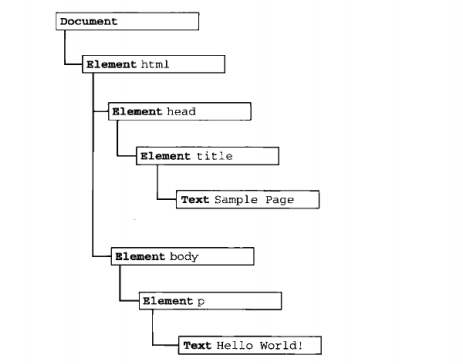

# DOM
## 节点层次
DOM可以将任何HTML或XML文档描绘成一个由多层节点构成的结构。节点分为几种不同的类型，每种类型分别表示文档中不同的信息及（或）标记。每个节点都拥有各自的特点、数据和方法，另外也与其他节点存在某种关系。节点之间的关系构成了层次，而所有页面标记则表现为一个以特定节点为根节点的树形结构。以下面的HTML为例：
```html
<html lang="en">
  <head>
    <title>Sample Page</title>
  </head>
  <body>

  </body>
</html>
```
可以将这个简单的HTML文档表示为一个层次结构，如下图所示。(本图参考JavaScript高级程序3)文档节点是每个文档的根节点。在这个例子中，文档节点只有一个子节点，即`<html>`元素，我们称之为文档元素。文档元素是文档的最外层元素，文档中的其他所有元素都包含在文档元素中。每个文档只能有一个文档元素。在HTML页面中，文档元素始终都是`<html>`元素。在XML中，没有预定义的元素，因此任何元素都可能成为文档元素。



每一段标记都可以通过树中的一个节点来表示：HTML元素通过元素节点表示，特性通过特性节点表示，文档类型通过文档类型节点表示，而注释则通过注释节点表示。总共有12中节点类型，这些类型都继承自一个基类型。

### 操作节点
**appendChild()** 用于向childNodes列表的末尾添加一个节点。如果传入到appendChild()中的节点已经是文档的一部分了，那结果就是将该节点从原来的位置转移到新位置。如果在调用appendChild()时传入了父节点的第一个子节点，那么该节点就会成为父节点的最后一个子节点。

**insertBefore()** 用于把节点放在某个特定的位置上。这个方法接受两个参数：要插入的节点和作为参照的节点。插入节点后，被插入的节点会变成参照的节点的前一个同胞节点，同时被方法返回。

**replaceChild()** 方法接受的两个参数是：要插入的节点和要替换的节点。要替换的节点将由这个方法返回并从文档树中移除，同时由要插入的节点占据其位置。

**removeChild()** 方法，接受一个参数，既要移除的节点。

**cloneNode()** 方法，接受一个布尔值参数，表示是否执行深复制，为true执行深复制，为
flase执行浅复制。
### Document类型
JavaScript通过Document类型表示文档。在浏览器中，document对象是HTMLDocument（继承自Document类型）的一个实例，表示整个HTML页面。而且，document对象是window对象的一个属性，因此可以将其作为全局对象来访问。

Document类型可以表示HTML页面或者其他基于XML的文档。不过，最常见的应用还是作为HTMLDocument实例的document对象。通过这个文档对象，不仅可以取得页面有关的信息，而且还能操作页面的外观及底层结构。

虽然DOM标准规定Document节点的子节点可以是Document、Element、ProcessingInstruction或Comment，但还有两个内置的访问其子节点的快捷方式。第一个就是documentElement属性，该属性始终指向HTML页面中的html元素。另一个就是通过childNodes列表访问文档元素。但通过documentElement属性则能更快捷、更直接地访问元素。以下这个简单的页面为例。
```html
<html>
  <body>
  </body>
</html>
```
这个页面在经过浏览器解析后，其文档中只包含一个子节点，即`<html>`元素。可以通过documentElement或childNodes列表来访问这个元素，如下所示。
```js
var html = document.documentElement;
console.log(html === document.childNodes[0]); // true
console.log(html === document.firstChild); // true
```
这个例子说明，documentElement、firstChild和childNodes[0]的值相同，都指向`<html>`元素。作为HTMLDocument的实例，document对象还有一个body属性，直接指向`<body>`元素。因为开发人员经常使用这个元素，所以document.body在JavaScript代码中出现的频率非常高，其用法如下。
```js
  var body = document.body;
  console.log(body); // 取得对 body 的引用
```
所有浏览器都支持document.documentElement和document.body属性。Document另一个可能的子节点是DocumentType。通常将<!DOCTYPE>标签看成一个与文档其他部分不同的实体，可以通过doctype属性（在浏览器中时document.doctype）来访问它的信息。
```js
  var doctype = document.doctype
  console.log(doctype); // 取得对<!DOCTYPE>的引用
```
### 文档信息
作为HTMLDocument的一个实例，document对象还有一些标准的Document对象所没有的属性。这些属性提供了document对象所表现的网页的一些信息。其中第一个属性就是 `<title>` ，包含着`<title>`元素中的文本--显示在浏览器窗口的标题栏或标签页上。通过这个属性可以取得当前页面的标题，也可以修改当前页面的标题并反映在浏览器的标题栏中。修改title属性的值会改变`<title>`元素。来看下面的例子。
```js
  // 取得文档标题
  var originalTitle = document.title;

  // 设置文档标题
  document.title = "New page title";
```
接下来介绍的3个属性都与对网页的请求有关，它们是 **URL、domain和referrer**。URL属性中包含页面完整的URL（即地址栏中显示的URL），domain属性中只包含页面的域名，而referrer属性中则保存着链接到当前页面的那个页面的URL。在没有来源页面的情况下，referrer属性中可能会包含空字符串。所有这些信息都存在于请求的HTTP头部，只不过通过这些属性让我们能够在JavaScript
中访问它们而已，如下面的例子所示。
```js
  // 取得完整的URL
  var url = document.URL;
  // 取得域名
  var domain = document.domain;
  // 取得来源页面的URL
  var referrer = document.referrer;
```
URL与domain属性是相互关联的。例如，如果document.URL等于http://www.wrox.com/WileyCDA/，那么document.domain就等于www.wrox.com。

在这3个属性中，只有domain是可以设置的。但由于安全方面的限制，也并非可以给domain设置任何值。
如果URL中包含一个子域名，例如p2p.wrox.com那么就只能将domain设置为"wrox.com"（URL中包含
"www"，如www.wrox.com时，也是如此）。不能将这个属性设置为URL中不包含的域，如下面的例子所示。
```js
  // 假设页面来自p2p.wrox.com域  
  document.domain = "wrox.com"; // 成功
  document.domain = "nczonline.net" // 出错！
```
当页面中包含来自其他子域的框架或内嵌框架时，能够设置document.domain就非常方便了。由于跨域安全限制，来自不同子域的页面无法通过JavaScript通信。而通过将每个页面的document.domain设置为相同的值，这些页面就可以互相访问对方包含的JavaScript对象了。例如，假设有一个页面加载自www.wrox.com，其中包含一个内嵌框架，框架内的页面加载自p2p.wrox.com。由于document.domain字符串不一样，内外两个页面之间无法相互访问对象的JavaScript对象。但如果将这两个页面的document.domain值都设置为"wrox.com"，它们之间就可以通信了。

浏览器对domain属性还有一个限制，即如果域名一开始是"松散的"（loose），那么不能将它再设置为"紧绷的"（tight）。换句话说，在将document.domain设置为"wrox.com"之后，就不能再将其设置回"p2p.wrox.com"，否则将会导致错误，如下面的例子所示。
```js
  // 假设页面来自于p2p.wrox.com域
  document.domain = "wrox.com";  // 松散的（成功）
  document.domain = "p2p.wrox.com"; // 紧绷的（出错！）
```
所有浏览器中都存在这个限制。

### 查找元素
说到最常见的DOM应用，恐怕就要数取得特定的某个或某组元素的引用，然后再执行一些操作了。取得元素的操作可以使用document对象的几个方法来完成。其中，Document类型为此提供了两个方法： **getElementById()和getElementByTagName()** 。

第一个方法， **getElementById()** ，接收一个参数：要取得的元素的ID。如果找到相应的元素则返回该元素，如果不存在带有相应ID的元素，则返回null。注意，这里的ID必须与页面中元素的id特性严格匹配，包括大小写。以下面的元素为例。
```js
  <div id="myDiv"></div>

  var div = document.getElementById("myDiv"); // 取得<div>元素的引用
```
另一个常用于取得元素引用的方法是 **getElementByTagName()**。这个方法接受一个参数，即要取得元素的标签名，而返回的是包含零或多个元素的NodeList。在HTML文档中，这个方法会返回一个HTMLCollection对象，作为一个"动态"集合，该对象与NodeList非常类似。例如，下列代码会取得页面中所有的``元素，并返回一个HTMLCollection。
```js
  var images = document.getElementsByTagName("img");
  console.log(images); // HTMLCollection(5)
```
这两行代码会将一个HTMLCollection对象保存在images变量中。可以使用括号语法或 **item()**方法来访问HTMLCollection对象中的项。而这个对象中元素的数量则可以通过其length属性取得，如下面所示。
```js
  var images = document.getElementsByTagName("img");
  console.log(images.length); // 5
  console.log(images[0].src); // 输出第一个图像元素的src特性
  console.log(images.item(0).src); // 输出第一个图像元素的src特性
```
HTMLCollection对象还有一个方法，叫做 **namedItem()**，使用这个方法可以通过元素的name特性取得
集合中的项。例如，假设上面提到的页面中包含如下````元素：
```js


// 那么就可以通过如下方式从images变量中取得这个  元素

var myImage = images.namedItem("myImage");
```
在提供按引索访问项的基础上，HTMLCollection还支持按名称访问项，这就为我们取得实际想要的元
素提供了便利。而且，对命名的项也可以使用方括号语法来访问，如下所示：
```js
  var myImage = images["myImage"];
```
对HTMLCollection而言，我们可以向方括号中传入数值或者字符串形式的索引值。在后台，对数值索
引就会调用 **item()**，而对字符串索引就会调用**namedItem()**。

要想取得文档中的所有元素。可以向getElementsByTagName()中传入"*"。在JavaScript及CSS中，
星号(*)通常表示"全部"。下面看一个例子。
```js
  var allElements = document.getElementsByTagName("*");
  console.log(allElements); // HTMLCollection(15)
```
仅此一行代码返回的HTMLCollection中，就包含了整个页面中的所有元素----按照它们出现的先后顺
序。换句话说，第一项是`<html>`元素，第二项是`<head>`元素，以此类推。

第三个方法， **getElementByName()** 。这个方法返回带有给定name特性的所有元素。

### Element类型
访问标签名可以使用 **tagName** 。看下面的例子：
```js
  <div id="myDiv"></div>

  // 可以像下面这样取得这个元素及其标签名
  var div = document.getElementById('myDiv');
  console.log(div.tagName); // DIV
```
需要注意的是实际输出的是"DIV"而非"div"。在HTML中，标签名始终都以全部大写表示。

### HTML元素
所有HTML元素都由HTMLElement类型表示，不是直接通过这个类型，也是通过它的子类型来表示。
HTMLElement类型直接继承自Element并添加一些属性。添加这些属性分别对应于每个HTML元素
中都存在的下列标准特性。
* id，元素在文档中的唯一标识符。
* title，有关元素的附加说明信息，一般通过工具提示条显示出来。
* lang，元素内容的语言代码，很少使用。
* dir，语言的方向，值为"ltr"（left-to-right，从左到右）或"rtl"（right-to-left，从右到左），也很少使用
* className，即为元素指定的CSS类。

以上的值都可以用来取得或者修改。看下面的例子：
```js
var div = document.getElementById("myDiv");
console.log(div.id); // myDiv
console.log(div.title); // Body text
console.log(div.lang); // en
console.log(div.dir); // ltr
console.log(div.className); // bd

div.id = "someOtherId";
div.className = "ft";
div.title = "Some other text";
div.lang = "fr";
div.dir = "rtl";
```
#### 取得特性（元素的属性）
操作特性的DOM方法主要有三个。分别是：**getAttribute()、setAttribute()、removeAttribute()**。

getAttribute()：获取元素的属性，也可以用来获取自定义的属性。
```js
  var div = document.getElementById("myDiv");
  console.log(div.getAttribute("id")); // myDiv
  console.log(div.getAttribute("class")); // bd
  console.log(div.getAttribute("title")); // Body text
  console.log(div.getAttribute("lang")); // en
  console.log(div.getAttribute("dir"));// ltr
  console.log(div.getAttribute("data-index")); // 1
```
有两类特殊的属性虽然有对应的属性名，但属性的值与通过getAttribute()返回的值并不相同。第一类是style，第二类是onclick。这里不过多讲解。可以自己在控制台看看。

#### 设置特性
**setAttribute()** ：设置元素属性，这个方法接受两个参数：要设置的特性名和值。
也可以操作自定义的属性。
```js
  var div = document.getElementById("myDiv");
  div.setAttribute("id", "someOtherId");
  div.setAttribute("class", "ft");
  div.setAttribute("title", "Some other text");
  div.setAttribute("lang", "fr");
  div.setAttribute("dir", "rtl");
```
最后一个方法是 **removeAttribute()** ，这个方法用于彻底删除元素的特性。调用这个
方法不仅会清除特性的值，而且也会从元素中完全删除特性。
```js
var div = document.getElementById("myDiv");
div.removeAttribute("class");
```
#### 创建元素
可以使用document.createElement()方法可以创建新元素。
```js
var div = document.createElement("div");
```
还可以为该元素添加属性。
```js
  var div = document.createElement("div");
  div.id = "myNewDiv";
  div.className = "box";
```
由于还没有添加到文档树中，可以使用 **appendChild()、insertBefore()或replaceChild()** 方法。
```js
  document.body.appendChild(div);
```
#### 元素的子节点
元素可以有任意数目的子节点和后代节点，因为元素可以是其他元素的子节点。元素的 **childNodes** 属性中包含了它的所有子节点。所以我们可以通过 **childNodes** 来访问该元素的所有子节点。这些子节点有可能是元素、文本节点、注释或处理命令。
```js
  <ul id="myList">
    <li>item 1</li>
    <li>item 2</li>
    <li>item 3</li>
  </ul>

  var list = document.getElementById("myList");
  console.log(list.childNodes); 
  // NodeList(7) [text, li, text, li, text, li, text]
```
`<ul>`元素都会有7个元素，包括3个`<li>` 元素和4个文本节点（表示li元素之间的空白符）。
如果把空白符删除了就会打印出三个`<li>`，像下面这样。
```html
<ul id="myList"><li>item 1</li><li>item 2</li><li>item 3</li></ul>
```
如果想通过某个特定的标签名取得子节点或后代节点可以使用 **getElementByTagName()** 方法。
```js
  var list = document.getElementById("myList");
  var items = list.getElementsByTagName("li");
  console.log(items); // HTMLCollection(3) [li, li, li]
```