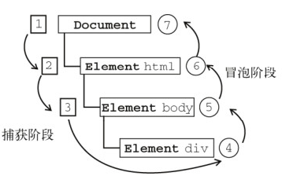

# 事件
## 事件流
事件流描述的是从页面中接收事件的顺序。
### 事件冒泡
事件冒泡，即事件开始时由最具体的元素（文档中嵌套层次最深的那个节点）接收，
然后逐级向上传播到较为不具体的节点（文档）。看下面的例子：
```html
<!DOCTYPE html>
<html lang="en">
<head>
  <title>Document</title>
</head>
<body>
  <div id="myDiv">Click Me</div>
</body>
</html>
```
如果你单击了页面中的`<div>`元素，click事件沿DOM树向上传播，在每一级节点上都会发生，直至传播到document对象。下面就是事件的传播顺序：
1. `<div>`
2. `<body>`
3. `<html>`
4. document

现代浏览器的事件冒泡则是将事件一直冒泡到window对象。
### 事件捕获
事件捕获的思想是不太具体的节点应该更早接收到事件，而最具体的节点应该最后接收到事件。事件捕获的用意在于在事件到达预定目标之前捕获它。就拿前面的HTML页面作为演示事件捕获的例子：
  1. document
  2. `<html>`
  3. `<body>`
  4. `<div>`
在事件捕获过程中，document对象首先接收到click事件，然后事件沿DOM树依次向下，一直
传播到事件的实际目标，即`<div>`元素。

### DOM事件流
事件流包括三个阶段：事件捕获阶段、处于目标阶段和事件冒泡阶段。以之前的HTML页面为例，
下图展示了顺序触发事件



在DOM事件流中，实际的目标（`<div>`元素）在捕获阶段不会接受到事件。这意味着在捕获阶段，事件从document到`<html>`再到`<body>`后就停止了。下一个阶段是“处于目标”阶段，于是事件在`<div>`上发生，并在事件处理中被看成冒泡阶段的一部分，然后，冒泡阶段发生，事件又传播回文档。

## 事件处理程序
**事件** 就是用户或浏览器自身执行的某种动作。诸如**click、load和mouseover**，都是事件的名字。而响应某个事件的函数就叫做事件处理程序（或事件侦听器）。事件处理程序的名字以"on"开头，因此click事件的事件处理程序就是onclick，load事件的事件处理程序就是onload。为事件指定处理程序的方式有好几种

### HTML事件处理程序
第一种用法：
```html
<input type="button" value="Click ME" onclick="alert('Clicked')">
```

第二种用法：
```js
<input type="button" value="Click ME" onclick="showMessage()">

function showMessage() {
  alert("Hello world");
}
```
HTML事件处理程序的缺点：存在一个时差问题。用户可能会在HTML元素出现在页面上就触发相应的事件，但事件处理程序
有可能尚不具备执行条件。HTML与JavaScript代码紧密耦合。

### DOM0级事件处理程序
使用DOM0级方法指定的事件处理程序被认为是元素的方法。因此，这时候的事件处理程序是在元素的作用域中运行；也就是说，程序中的this引用当前的元素。
```js
<input type="button" id="myBtn" value="Click ME">

var btn = document.getElementById("myBtn");
btn.onclick = function() {
  console.log(this.id);
}
```
以这种方式添加的事件处理程序会在事件流的冒泡阶段被处理。也可以删除通DOM0级方法指定事件处理程序。直接将事件处理程序设置为null即可：
```js
btn.onclick = null;
```
将事件处理程序设置为null之后，再单击按钮将不会有任何动作发生。
### DOM2级事件处理程序
DOM2级事件定义了两个方法，用于处理指定和删除事件处理程序的操作：**addEventListener()和removeEventListener()**。并且它们都接受3个参数：要处理的事件名、作为事件处理程序的函数和一个布尔值。最后这个布尔值参数如果是true，表示在捕获阶段调用事件处理程序；如果是false，表示在冒泡阶段调用事件处理程序。看下面的例子：
```js
var btn = document.getElementById("myBtn");
btn.addEventListener("click", function(){
  alert(this.id);
}, false);
```
使用DOM2级方法添加事件处理程序的主要好处是可以添加多个事件处理程序。看下面的例子：
```js
var btn = document.getElementById("myBtn");

btn.addEventListener("click", function(){
  alert(this.id);
}, false);

btn.addEventListener("click", function(){
  alert("Hello world");
}, false);
```
通过 **addEventListener()** 添加的事件处理程序只能使用 **removeEventListener()** 来移除，移除时传入的参数与添加处理程序时使用的参数相同。这也意味着通过addEventListener()添加的匿名函数将无法移除，如下面的例子：
```js
var btn = document.getElementById("myBtn");

btn.addEventListener("click", function(){
  alert(this.id);
}, false);

btn.removeEventListener("click", function(){ // 没有用
  alert(this.id);
}, false);
```
如果想要移除 **removeEventListener()** 中的事件处理程序函数必须与传入 **addEventListener()** 中的相同，看下面的例子：
```js
  var btn = document.getElementById("myBtn");

  var handler = function() {
    alert(this.id);
  }

  btn.addEventListener("click", handler, false);

  btn.removeEventListener("click", handler, false); // 有用
```
## 事件对象
在触发DOM上的某个事件时，会产生一个事件对象 **event**，这个对象中包含着所有与事件有关的信息。包括导致事件的元素、事件的类型以及其他与特定事件相关的信息。例如，鼠标操作导致的事件对象中，会包含鼠标位置的信息，而键盘操作导致的事件对象中，会包含与按下的键有关的信息。所有浏览器都支持 **event** 对象，但支持方式不同。

DOM的浏览器会将一个 **event** 对象传入到事件处理程序中。无论指定事件处理程序时使用什么方
法（DOM0级或DOM2级），都会传入 **event** 对象。看下面的例子：
```js
  var btn = document.getElementById("myBtn");
  btn.onclick = function(event) {
    console.log(event.type); // click
  }
```
**event** 对象包含与创建它的特定事件有关的属性和方法。触发的事件类型不一样，可用的属性和
方法也不一样。所有事件都会有下面列出的成员。
* **bubbles**：返回布尔值，表明事件是否冒泡。
* **cancelable**：返回布尔值，表明是否可以取消事件的默认行为
* **currentTarget**：返回其事件处理程序当前正在处理事件的那个元素
* **defaultPrevented**：为true表示已经调用了preventDefault()
* **detail**：与事件相关的细节信息
* **eventPhase**：返回事件处理程序的阶段：1表示捕获阶段，2表示“处于目标”，3表示冒泡阶段
* **preventDefault**：取消事件的默认行为。如果cancelable是true，则可以使用这个方法。
* **target**：返回事件的目标（触发此事件的元素）
* **type**：被触发的事件类型

在事件处理程序内部，对象**this**始终等于**currentTarget**的值，来看下面的例子：
```js
  var btn = document.getElementById("myBtn");
  btn.onclick = function(event) {
    console.log(event.currentTarget === this); // true
    console.log(event.target === this); // true
  }
```
在需要通过一个函数处理多个事件时，可以使用type事件。例如：
```js
var btn = document.getElementById("myBtn");
var handler = function(event) {
  switch(event.type){
    case "click":
      console.log("Clicked");
      break;
    case "mouseover":
      event.target.style.backgroundColor = "red";
      break;
    case "mouseout":
      event.target.style.backgroundColor = "";
      break;
  }
};

btn.onclick = handler;
btn.onmouseover = handler;
btn.onmouseout = handler;
```
要阻止特定事件的默认行为，可以使用 **preventDefault()** 方法。例如，链接的默认行为就是在被单击时会导航到其href特性指定的URL。如果你想阻止链接导航这一默认行为。
```js
<a href="www.baidu.com" id="myLink">www.baidu.com</a>

var link = document.getElementById("myLink");
link.onclick = function(event) {
  event.preventDefault();
}
```
另外，**stopPropagation()** 方法用于立即停止事件在DOM层次中的传播，即取消进一步的事件捕获或冒泡。看下面的例子：
```js
var btn = document.getElementById("myBtn");
btn.onclick = function(event) {
  console.log("Clicked");
  event.stopPropagation(); // 如果注释掉，可以在控制台看到打印出两行
}

document.body.onclick = function(event) {
  console.log("Body clicked");
}
```
## 事件类型
DOM3级事件有以下几类事件：
* UI（用户界面）事件，当用户在与页面上的元素交互时触发；
* 焦点事件，当元素获得或失去焦点时触发；
* 鼠标事件，当用户通过鼠标在页面上执行操作时触发；
* 滚轮事件，当使用鼠标滚轮（或类似设备）时触发；
* 文本事件，当在文档中出入文本时触发；
* 键盘事件，当用户通过键盘在页面上执行操作时触发；
* 合成事件，当为IME（输入法编辑器）输入字符时触发；
* 变动事件，当底层DOM结构发生改变时触发。

### UI事件
UI事件，现有的UI事件如下：
* **load**：当页面完全加载后再window上触发，也可以用于框架和`、<object>`元素上
* **unload**：当页面完全卸载后在window上触发，也可以用于框架和`、<object>`元素上
* **abort**：在用户停止下载过程时，如果嵌入的内容没有加载完，则在`<object>`元素上触发。
* **error**：当发生JavaScript错误时在window上面触发，也可以用于框架和`、<object>`元素上
* **select**：当用户选择文本框（`<input>或<texterea>`）中的一或多个字符时触发。
* **resize**：当窗口或框架的大小变化时在window或框架上触发。
* **scroll**：当用户滚动带滚动条的元素中的内容时，在该元素上面触发。`<body>`元素中包含所加载页面的滚动条。
#### load事件
```js
window.onload = function() {
  alert("页面加载完毕！");
}
```
#### unload事件
unload事件，只要用户从一个页面切换到另一个页面，就会发生unload事件。
一般利用于清除引用，以避免内存泄漏。

#### resize事件
resize事件，当浏览器窗口调整到一个新的高度或宽度时，就会触发resize事件
```js
window.onresize = function() {
  console.log("Resized");
}
```
#### scroll事件
scroll事件，虽然scroll事件是在window对象上发生的，但它实际表示的则是页面中相应元素的变化。在混杂模式下，可以通过`<body>`元素的 **scrollLeft和scrollTop** 来监控到这一变化；在标准模式下，可以通过`<html>`元素来反映这一变化。
```js
<div style="height: 2000px;width: 2000px;"></div>

window.onscroll = function() {
  alert("屏幕在滚动");
}
```
### 焦点事件
焦点事件有以下几个：
* **blur**：在元素失去焦点时触发，这个事件不会冒泡；
* **focus**：在元素获得焦点时触发。这个事件不会冒泡；
* **focusin**：在元素获得焦点时触发。和focus事件等价。
* **focusout**：在元失去焦点时触发。和blur事件等价。

### 鼠标和滚轮事件
DOM3级事件中定义了9个鼠标事件，简介如下：
* **click**：在用户单击主鼠标按钮或者按下回车键时触发。
* **dblclick**：在用户双击主鼠标按钮时触发。
* **mousedown**：在用户按下了任意鼠标按钮时触发。
* **mouseenter**：在鼠标光标从元素外部首次移动到元素范围之内触发。
* **mouseleave**：在位于元素上方的鼠标光标移动到元素范围之外时触发。
* **mousemove**：在鼠标指针在元素内部移动时重复地触发。
* **mouseout**：在鼠标指针位于一个元素上方，然后用户将其移入另一个元素时触发。
* **mouseover**：在鼠标指针位于一个元素外部，然后用户将其首次移入另一个元素边界之内是时触发。
* **mouseup**：在元素释放鼠标按钮时触发。

#### 客户区坐标位置
鼠标事件都是在浏览器视口中的特定位置上发生的。这个位置信息保存在事件对象的clientX和clientY
属性中。它们的值表示事件发生时鼠标指针在视口中的水平和垂直坐标。
```js
var btn = document.getElementById("myBtn");
btn.onclick = function(event) {
  console.log("按钮的X坐标为", event.clientX + " 按钮的Y坐标为",event.clientY);
}
```
#### 页面坐标位置
页面坐标通过事件对象的pageX和pageY属性，能告诉你事件在页面中的什么位置发生。这两个属性
表示鼠标光标在页面中的位置，因此坐标是从页面本身而非视口在左边和顶边计算的。

#### 屏幕坐标位置
通过screenX和screenY属性就可以确定鼠标事件发生时鼠标指针相对于整个屏幕的坐标信息。

#### 鼠标滚轮事件
当用户通过鼠标滚轮与页面交互、在垂直方向上滚动页面是（无论向上还是向下），就会触发
mousewheel事件。还包含一个特殊的wheelDelta属性。当用户向前滚动鼠标滚轮时，wheelDelta
是120的倍数；当用户向后滚动鼠标滚轮时，wheelDelta是-120的倍数。
```js
  window.onmousewheel = function(event) {
    console.log("用户操作了鼠标滚轮", event.wheelDelta);
  }
```
### 键盘事件
有3个键盘事件，简述如下：
* **keydown**：当用户按下键盘上的任意键时触发，如果按住不放的话，会重复触发此事件。
* **keypress**：当用户按下键盘上的字符键时触发，如果按住不放的话，会重复触发此事件。
* **keyup**：当用户释放键盘上的键时触发。

### HTML5事件
**contextmenu** 事件（自定义上下文菜单）

**beforeunload** 事件，是为了让开发人员有可能在页面卸载前阻止这一操作。这个事件会在浏览器
卸载页面之前触发。

**DOMContentLoaded** 事件，在形成完整的DOM树之后就会触发，不理会图像、JavaScript文件、CSS文件或其他资源是否已经下载完毕。

**hashchange** 事件，在URL的参数列表发生变化时触发。必须要把hashchange事件添加给window对象，然后URL参数列表只要变化就会调用它。此时的event对象应该额外包含两个属性：oldURL和newURL。这两个属性分别保存着参数列表变化前后的完整URL。由于oldURL和newURL存在兼容性问题，最好是使用location对象来确定当前的参数列表。

### 触摸与手势事件
触摸事件会在用户手指放在屏幕上面时、在屏幕上滑动时或从屏幕上移开时触发。有以下几种触摸事件。
* **touchstart**：当手指触摸屏幕时触发；即使已经有一个手指放在了屏幕上也会触发。
* **touchmove**：当手指在屏幕上滑动时连续地触发。在这个事件发生期间，调用preventDefault()可阻止滚动。
* **touchend**：当手指从屏幕上移开时触发。
* **touchcancel**：当系统停止跟踪触摸时触发。

上面的几个事件都会冒泡。也都可以取消。

触摸事件还包含下列是三个用于跟踪触摸的属性。
* **touches**：表示当前跟踪的触摸操作的Touch对象数组。
* **targetTouchs**：特定于事件目标的Touch对象的数组。
* **changeTouches**：表示自上次触摸以来发生了什么改变的Touch对象的数组。

每个Touch对象包含下列属性。
* **clientX**：触摸目标的视口中的x坐标。
* **clientY**：触摸鼠标在视口中的y坐标。
* **identifier**：标识触摸的唯一ID。
* **pageX**：触摸目标在页面中的x坐标。
* **pageY**：触摸目标在页面中的y坐标。
* **screenX**：触摸目标在屏幕中的x坐标。
* **screenY**：触摸目标在屏幕中的y坐标。
* **target**：触摸的DOM节点目标。
## 内存和性能
在JavaScript中，添加到页面上的事件数量将直接关系到页面的整体运行性能。导致这一问题的原因是多方面的。首先，每个函数都是对象，都会占用内存；内存中的对象越多，性能就会越差。其次，必须事先指定所有事件而导致的DOM访问次数，会延迟整个页面的交互就绪时间。

### 事件委托
事件委托利用了事件冒泡，只指定一个事件处理程序，就可以管理某一类型的所有事件。
```js
<ul id="myLinks">
  <li id="goSomewhere">Go somewhere</li>
  <li id="doSomething">Do something</li>
  <li id="sayHi">Say Hi</li>
</ul>

var list = document.getElementById("myLinks");
list.onclick = function(event) {
  switch (event.target.id) {
    case "goSomewhere":
      alert("Hello JavaScript");
      break;
    case "doSomething":
      alert("Hello xiaoli");
      break;
    case "sayHi":
      alert("Hello world");
      break;
  }
}
```
事件委托的优点：
在页面中设置事件所需的时间更少，只要添加一个事件所需的DOM引用更少，所花的时间也更少。
内存空间占用少，减少事件的注册。

事件委托的局限：
虽然mouseover和mouseout事件也冒泡，但要适当处理它们并不容易，而且经常需要计算元素的位置。

### 移除事件处理程序
如果你知道某个元素即将被移除，那么最好手工移除事件。比如，将按钮的事件设置为null。这样就能确保了内存可以被再次利用。

移除事件最好的做法是在页面卸载之前，先通过onunload事件移除所有事件。事件委托再次表现它的优势----需要跟踪的事件越少，移除它们就越容易。

## 模拟事件
### DOM中的事件模拟
可以在 **document对象上** 使用 **createEvent()** 方法创建event对象。这个方法接收一个参数，即表示要创建的事件类型。在DOM2级中，所有这些字符串都使用英文复数形式，而在DOM3级中都变成了单数。这个字符串可以是下列几个字符串之一。
* **UIEvents**：一般化的UI事件。鼠标事件和键盘事件都继承自UI事件。DOM3级中时UIEvent。
* **MouseEvents**：一般化的鼠标事件。DOM3级中是MouseEvent。
* **MutationEvents**：一般化的DOM变动事件。DOM3级中是MutationEvent。
* **HTMLEvents**：一般化的HTML事件。没有对应的DOM3级事件。

#### 模拟鼠标事件
创建鼠标事件对象的方法是 **createEvent()** 传入字符串 **"MouseEvents"** 。返回的对象有一个名为 **initMouseEvent()** 方法，用于指定与该鼠标事件有关的信息。这个方法接收15个参数，分别与鼠标事件中每个典型的属性一一对应；这些参数的含义如下。
* **type**：表示要触发的事件类型，例如"click"。
* **bubbles（布尔值）**：布尔值，表示事件是否应该冒泡。为精确地模拟鼠标事件，应该把这个参数设置为true。
* **cancelable（布尔值）** ：表示事是否可以取消。为精确地模拟鼠标事件，应该把这个参数设置为true。
* **view**：与事件关联的视图。这个参数几乎总是设置为document.defaultView。
* **detail（整数）**：与事件有关的详细信息。这个值一般只有事件处理程序使用，但通常都设置为0。
* **screenX（整数）**：事件相对于屏幕的X坐标。
* **screenY（整数）**：事件相对于屏幕的Y坐标。
* **clientX（整数）**：事件相对于视口的X坐标。
* **clientY（整数）**：事件相对于视口的Y坐标。
* **ctrlKey（布尔值）**：表示是否按下Ctrl键。默认值为false。
* **altKey（布尔值）**：表示是否按下Alt键。默认值为false。
* **shiftKey（布尔值）**：表示是否按下Shift键。默认值为false。
* **metaKey（布尔值）**：表示是否按下Meta键。默认值为false。
* **button（整数）**：表示按下了哪一个鼠标键。默认值为0。
* **relatedTarget（对象）**：表示与事件相关的对象。这个参数只在模拟mouseover或mouseout时使用。

前4个参数对正确地激发事件至关重要，因为浏览器要用到这些参数；而剩下的所有参数只有在事件中才会用到。当把 **event** 对象传给 **dispatchEvent()** 方法时，这个对象的 **target** 属性会自动设置。看下面的例子：
```js
var btn = document.getElementById("myBtn");
var fn = function() {
  console.log("button was clicked");
}
// click事件绑定事件处理程序
btn.addEventListener('click', fn);

// 创建事件对象
var event = document.createEvent("MouseEvents");

// 初始化事件对象
event.initMouseEvent("click", true, true, document.defaultView);

// 触发事件
btn.dispatchEvent(event);
```
通过上面的事件，我们就能触发btn元素的click事件，首先我们为元素绑定了click事件，这个事件需要用户操作才能触发。通过createEvent创建了鼠标事件对象，通过initMouseEvent初始化了事件对象。然后通过元素的dispatchEvent方法来触发事件。

#### 模拟键盘事件
调用createEvent()并传入"KeyboardEvent"就可以创建一个键盘事件。返回的对象事件会包
含一个initKeyEvent()方法，这个方法接收下列参数：
* **type**：表示要触发的事件类型，如"keydown"。
* **bubbles**：表示事件是否应该冒泡。为精确模拟鼠标事件，应该设置为true。
* **cancelable**：表示事件是否可以取消。为精确模拟鼠标事件，应该设置为true。
* **view**：与事件关联的视图。这个参数几乎总是要设置为document.defaultView。
* **key（布尔值）**：表示按下的键的键码。
* **location（整数）**：表示按下了哪里的键。0表示默认的主键盘，1表示左，2表示右，3表示数字键盘，4表示移动设备（即虚拟键盘），5表示手柄。
* **modifiers（字符串）**：空格分隔的修改键列表，如"Shift"。
* **repeat（整数）**：在一行中按了这个键多少次。
```js
var txt = document.getElementById("inputText"), event;
event = document.createEvent("KeyboardEvent");

// 初始化事件对象
event.initKeyboardEvent("keydown", true, true, document.defaultView, "a", 0, "Shift", 0);

// 触发事件
txt.dispatchEvent(event);
```
这个例子模拟的是按住Shift的同时又按下A键。

#### 模拟其他事件
有时候同样需要模拟变动事件和HTML事件。要模拟变动事件，可以使用 **createEvent("MutationEvents")** 创建一个包含 **initMutationEvent()** 方法的变动事件对象。这个方法接受的参数包括：**type、bubbles、cancelable、relatedNode、preValue、newValue、attrName和attrChange** 。看下面的例子。
```js
var event = document.createEvent("MutationEvents");
event.initMutationEvent("DOMNodeInserted", true, false, someNode, "", "", "", 0);
target.dispatchEvent(event);
```
以上代码模拟了DOMNodeInserted事件。其他变动事件也都可以照这个样子模拟，只要改一改参数就可以了。

要模拟HTML事件，同样需要先创建一个event对象----通过createEvent("HTMLEvents")，然后再使用这
个对象的initEvent()方法来初始化它，看下面的例子：

  var event = document.createEvent("HTMLEvents");
  event.initEvent("focus", true, false);
  target.dispatchEvent(event);

这个例子展示了如何在给定目标上模拟focus事件。模拟其他HTML事件的方法也是这样。

#### 自定义DOM事件
要创建新的自定义事件，可以调用 **createEvent("CustomEvent")**。返回的对象有一个名为 **initCustomEvent()** 方法，接收如下4个参数：
* **type**：触发的事件类型，例如"keydown"。
* **bubbles**：表示事件是否应该冒泡。
* **cancelable**：表示事件是否可以取消。
* **detail（对象）**：任意值，保存在event对象的detail属性中。

可以像分派其他事件一样在DOM中分派创建的自定义事件对象。看下面的例子：
```js
var div = document.getElementById("myDiv"),
    event;
div.addEventListener("myevent",function(event){
  console.log("DIV  " + event.detail);
})
event = document.createEvent("CustomEvent");
event.initCustomEvent("myevent", true, false, "Hello world！");
div.dispatchEvent(event);
```
这个例子创建了一个冒泡事件"myevent"。而event.detail的值被设置成了一个简单的字符串，然后在`<div>`元素和document上侦听这个事件。因为initCustomEvent()方法已经指定这个事件应该冒泡，所以浏览器会负责将事件向上冒泡到document。