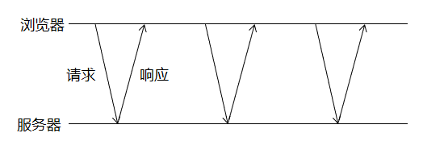
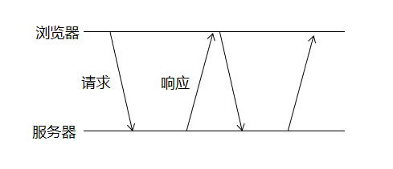

# Ajax与Comet
Ajax技术的核心是XMLHttpRequest对象（简称XHR）。

## XMLHttpRequest对象
要创建XHR对象要像下面这样使用XMLHttpRequest构造函数。
```js
var xhr = new XMLHttpRequest();
```

### XHR的用法
在使用XHR对象时，要调用的第一个方法是 **open()**，它接受3个参数：要发送的请求的类型（"get"、"post"等）、
请求的URL和表示是否异步发送请求的布尔值。来看个例子：
```js
var xhr = new XMLHttpRequest();
xhr.open("get", "localhost:8080/example.php", false);
```
URL相对于执行代码的当前页面（也可以使用绝对路径）；调用open()方法并不会真正发送请求，而只是启动一个请求
以备发送。
:::warning
只能向同一个域中使用相同端口和协议的URL发送请求。如果URL与启动请求的页面有任何差别，都发生跨域。
:::

要发送特定的请求，必须像下面这样调用 **send()** 方法：
```js
xhr.open("get", "localhost:8080/example.php", false);
xhr.send(null);
```
这里的send()方法接收一个参数，即要作为请求主体发送的数据。如果不需要通过请求主体发送数据，则必须传入null，因为这个参数对有些浏览器来说是必需的。调用send()之后，请求就会被分派到服务器。

由于这次请求是同步的，JavaScript代码会等到服务器响应之后再继续执行。在收到响应后，响应的数据会自动填充XHR对象的属性，相关属性简介如下：
* responseText: 作为响应主体被返回的文本。
* responseXML: 如果响应的内容类型是"text/xml"或"application/xml"，这个属性中将保存包含着响应数据的XML DOM文档。
* status：响应的HTTP状态。
* stateusText：HTTP状态的说明。

在接收到响应后，第一步是检查status属性，以确定响应已经成功返回。一般来说，可以将HTTP状态代码为200作为成功的标志。此时，responseText属性的内容已经就绪，而且在内容类型正确的情况下，responseXML也应该能够访问了。为确保接收到适当的响应，应该像下面这样检查上述这两种状态代码：
```js
var xhr = new XMLHttpRequest();
xhr.open("get", "localhost:8080/example.php", false);
xhr.send(null);
if (xhr.status >= 200 && xhr.status < 300 || xhr.status == 304) {
  console.log(xhr.responseText);
} else {
  console.log(xhr.status);
}
```
根据返回的状态代码，这个例子可能会显示由服务器返回的内容，也可能会显示一条错误消息。无论内容类型是什么，响应主体的内容都会保存到responseText属性中；而对于非XML数据而言，responseXML属性的值将为null。

多数情况下，我们还是要发送异步请求，才能让JavaScript继续执行而不必等待响应。此时，可以检测XHR对象的 **readyState** 属性，该属性表示请求/响应过程的当前活动阶段。这个属性可取的值如下：
* 0: 未初始化。尚未调用open()方法
* 1: 启动。已经调用open()方法，但尚未调用send()方法。
* 2: 发送。已经调用send()方法，但尚未接收到响应。
* 3: 接收。已经接收到部分响应数据。
* 4: 完成。已经接收到全部响应数据，而且已经可以在客户端使用了。

只要readyState属性的值由一个值变成另一个值，都会触发一次readyStatechange事件。可以利用这个事件来检测每次状态变化后readyState的值。我们只对readyState值为4的阶段感兴趣，因为这时所有数据都已经就绪。必须在调用 **open()**之前指定onreadystatechange事件才能确保跨浏览器兼容性。看下面的例子：
```js
var xhr = new XMLHttpRequest();
xhr.onreadystatechange = function() {
  if (xhr.readyState == 4) {
    if (xhr.status >= 200 && xhr.status < 300 || xhr.status == 304) {
      console.log(xhr.responseText);
    } else {
      console.log(xhr.status);
    }
  }
}
// 可以从easy-mock网站里自行模拟接口
var url = "https://www.easy-mock.com/mock/5dbc5cea9e771148eb1d91ba/example/getData";
xhr.open("get", url, true);
xhr.send(null);
```

另外，在接收到响应之前还可以调用 **abort()** 方法来取消异步请求，如下所示: 
```js
xhr.abort();
```
调用这个方法后，XHR对象会停止触发事件，而且也不再允许访问任何于响应有关的对象属性。在终止请求之后，在应该对XHR进行解引操作。由于内存原因，不建议重用XHR对象。

### HTTP头部信息
每个HTTP请求和响应都会带有相应的头部信息，XHR对象也提供了操作这两种头部（即请求头部和响应头部）信息的方法。

默认情况下，在发送XHR请求的同时，还会发送下列头部信息。
* Accept：浏览器能够处理的内容类型。
* Accept-Charset：浏览器能够显示的字符集。
* Accept-Encodeing：浏览器能够处理的压缩编码。
* Accept-Language：浏览器当前设置的语言。
* Connection：浏览器与服务器之间连接的类型。
* Cookie：当前页面设置的任何Cookie。
* Host：发出请求的页面所在的域。
* Referer：发送请求的页面的URI。注意，HTTP规范将这个头部字段拼写错了，而为保证与规范一致，也只能将错就错了。
* User-Agent：浏览器的用户代理字符串。

使用 **setRequestHeader()** 方法可以设置自定义的请求头部信息。这个方法接受两个参数：头部字段的名称和头部字段的值。要成功发送请求头部信息，必须在调用open()方法之后且调用send()方法之前调用 **setRequestHeader()**。看下面的例子：
```js
var xhr = new XMLHttpRequest();
xhr.onreadystatechange = function() {
  if (xhr.readyState == 4) {
    if (xhr.status >= 200 && xhr.status < 300 || xhr.status == 304) {
      console.log(xhr.responseText);
    } else {
      console.log(xhr.status);
    }
  }
}
var url = "https://www.easy-mock.com/mock/5dbc5cea9e771148eb1d91ba/example/getData";
xhr.open("get", url, false);
xhr.setRequestHeader("MyHeader", "MyValue");
xhr.send(null);
```
服务器在接收到这种自定义的头部信息之后，可以执行相应的后续操作。在使用自定义的头部字段名称时，不要使用浏览器正常发送的字段名称，否则有可能会影响服务器的响应。

调用XHR对象的 **getResponseHeader()** 方法并传入头部字段名称，可以取得相应的响应头部信息。而调用
**getAllResponseHeaders()** 方法则可以取得一个包含所有头部信息的长字符串。来看下面的例子：
```js
var xhr = new XMLHttpRequest();
xhr.onreadystatechange = function() {
  if (xhr.readyState == 4) {
    if (xhr.status >= 200 && xhr.status < 300 || xhr.status == 304) {
      console.log(xhr.responseText);
    } else {
      console.log(xhr.status);
    }
  }
}
var url = "https://www.easy-mock.com/mock/5dbc5cea9e771148eb1d91ba/example/getData"
xhr.open("get", url, false);
xhr.setRequestHeader("MyHeader", "MyValue");
xhr.send(null);
var myHeader = xhr.getResponseHeader("MyHeader");
var allHeaders = xhr.getAllResponseHeaders();
console.log(allHeaders); // 可以自己打印出来在控制台可以看到
```

### GET请求
使用GET请求经常发生的一个错误，就是查询字符串的格式有问题。查询字符串中每个参数的名称和值都必须使用encodeURIComponent()进行编码，然后才能放到URL的末尾；而且所有名-值对儿都必须由和号（&）分隔，如下面的例子所示：
```js
xhr.open("get", "https://www.easy-mock.com/mock/5dbc5cea9e771148eb1d91ba/example/getData?name1=1&name2=2", true);
```
下面这个函数可以辅助向现有URL的末尾添加查询字符串参数：
```js
function addURLParam(url, name, value) {
  url += (url.indexOf("?") == -1 ? "?" : "&");
  url += encodeURIComponent(name) + "=" + encodeURIComponent(value);
  return url;
}
```
使用这个函数来构建请求URL的示例：
```js
var url = "https://www.easy-mock.com/mock/5dbc5cea9e771148eb1d91ba/example/getData";

// 添加参数
url = addURLParam(url, "name", "xiaoli");
url = addURLParam(url, "age", "21");

// 初始化请求
xhr.open("get", url, false);
```

### POST请求
POST请求应该把数据作为请求的主体提交，而GET请求传统上不是这样。POST请求的主体可以包含非常多的数据，而且格式不限。在open()方法第一个参数的位置传入"post"，就可以初始化一个POST请求，如下面的例子所示。
```js
var url = "https://www.easy-mock.com/mock/5dbc5cea9e771148eb1d91ba/example/getData"
xhr.open("post", url, false);
```
我们可以模拟表单提交，看看POST的用法。
```js
var xhr = new XMLHttpRequest();
xhr.onreadystatechange = function() {
  if (xhr.readyState == 4) {
    if (xhr.status >= 200 && xhr.status < 300 || xhr.status == 304) {
      console.log(xhr.responseText);
    } else {
      console.log(xhr.status);
    }
  }
}
// 可以从easy-mock网站里自行模拟接口
var url = "https://www.easy-mock.com/mock/5dbc5cea9e771148eb1d91ba/example/getData"
xhr.open("POST", url, true);

// 设置请求头部
xhr.setRequestHeader("Content-Type", "application/x-www-form-urlencoded");

// 这里是假设form对象已经获取
xhr.send(serialize(form));
```

## XMLHttpRequest2级

### FormData
FormData为序列化表单以及创建与表单格式相同的数据（用于通过XHR传输）提供了便利。来看个例子：
```js
var data = new FormData();
data.append("name", "xiaoli");
```
这个 **append()** 方法接收两个参数：键和值，分别对应表单字段的名字和字段中包含的值。也可以添加任意多个键值对儿。通过向FormData构造函数中传入表单元素，也可以用表单元素的数据预先向其中填入键值对儿：
```js
var data = new FormData(document.forms[0]);
```
创建了FormData的实例后，可以将它直接传给XHR的send()方法，如下所示：
```js
var xhr = new XMLHttpRequest();

xhr.onreadystatechange = function() {
  if (xhr.readyState == 4) {
    if ((xhr.status >= 200 && xhr.status < 300) || xhr.status == 304) {
      console.log(xhr.responseText);
    } else {
      console.log(xhr.status);
    }
  }
};
var url = "https://www.easy-mock.com/mock/5dbc5cea9e771148eb1d91ba/example/getData"
xhr.open("post", url, true);

var form = document.getElementById("user-info");
xhr.send(new FormData(form));
```
使用FormData的方便之处体现在不必明确地在XHR对象上设置请求头部。XHR对象能够识别传入的数据类型是FormData的实例，并配置适当的头部信息。

### 超时设定
XHR对象添加一个timeout属性，表示请求在等待响应多少毫秒之后就终止。在给timeout设置一个数值后，如果在规定的时间内浏览器还没有接收到响应，那么就会触发timeout时间，进而会调用ontimeout事件。来看下面的例子：
```js
var xhr = new XMLHttpRequest();

xhr.onreadystatechange = function() {
  if (xhr.readyState == 4) {
    try {
      if ((xhr.status >= 200 && xhr.status < 300) || xhr.status == 304) {
        console.log(xhr.responseText);
      } else {
        console.log(xhr.status);
      }
    } catch (error) {
      // 假设由ontimeout事件处理
    }
  }
};
var url = "https://www.easy-mock.com/mock/5dbc5cea9e771148eb1d91ba/example/getData"
xhr.open("post", url, true);

xhr.timeout = 1000; // 将超时设置为1秒钟
xhr.ontimeout = function() {
  alert("Request did not return in a second.")
}

var form = document.getElementById("user-info");
xhr.send(new FormData(form));
```
### overrideMimeType()方法
**overrideMimeType()** 方法，用于重写XHR响应的MIME类型。比如，服务器返回的MIME类型是text/plain，但数据中实际包含的是XML。根据MIME类型，即使数据是XML，responseXML属性中仍然是null。通过调用 **overrideMimeType()** 方法，可以保证把响应当作XML而非纯文本来处理。
```js
var xhr = new XMLHttpRequest();
xhr.open("get", "text.php", true);
xhr.overrideMimeType("text/xml");
xhr.send(null);
```
这个例子强迫XHR对象将响应当作XML而非纯文本来处理。调用overrideMimeType()必须在send()方法之前，才能保证重写响应的MIME类型。

## 进度事件
有以下6个进度事件：
* loadstart：在接收响应数据的第一个字节触发。
* progress：在接收响应期间持续不断地触发。
* error：在请求发生错误时触发。
* abort：在因为调用abort()方法而终止连接时触发。
* load：在接收到完整的响应数据时触发。
* loadend：在通信完成或触发error、abort或load事件后触发。

每个请求都从触发loadstart事件开始，接下来是一或多个progress事件，然后触发error、abort或load事件中的一个，最后以触发loadend事件结束。这些事件大都很直观，但其中两个事件有一些细节需要注意。

### load事件
```js
var xhr = new XMLHttpRequest();

xhr.onload = function() {
  if ((xhr.status >= 200 && xhr.status < 300) || xhr.status == 304) {
    console.log(xhr.responseText);
  } else {
    console.log(xhr.status);
  }
}
xhr.open("get", "altevents.php", true);
xhr.send(null);
```
只要浏览器接收到服务器的响应，不管其状态如何，都会触发onload事件。而这意味着必须要检查status属性，才能确定数据是否真的已经可用了。

### progress事件
**progress** 这个事件会在浏览器接收新数据期间周期性地触发。而onprogress事件会接收到一个event对象，其target属性是XHR对象，但包含着三个额外的属性：**lengthComputable、position和totalSize**。其中，**lengthComputable** 是一个表示进度信息是否可用的布尔值，**position** 表示已经接收的字节数，**totalSize** 表示根据Content-Length响应头部确定的预期字节数。有了这些信息，可以为用户创建一个进
度指示器了。来看下面的例子：
```js
var xhr = new XMLHttpRequest();

xhr.onload = function(event) {
  if ((xhr.status >= 200 && xhr.status < 300) || xhr.status == 304) {
    console.log(xhr.responseText);
  } else {
    console.log(xhr.status);
  }
};
xhr.onprogress = function(event) {
  console.log(event);
  var divStatus = document.getElementById("status");
  if (event.lengthComputable) {
    // 这里的每个事件每个浏览器可能存在差异或者是某规范和标准已经把事件的字段修改了
    // 可以自己打印event在控制台查看
    divStatus.innerHTML = "Received" + event.position + "of " +
      event.totalSize + "bytes";
  }
}
xhr.open("get", "https://www.easy-mock.com/mock/5dbc5cea9e771148eb1d91ba/example/getData", true);
xhr.send(null);
```
必须在调用open()方法之前添加onprogress事件。每次触发progress事件，都会以新的状态信息更细HTML元素的内容。如果响应头部中包含Content-Length字段，那么也可以利用此信息来计算响应中已接收到的数据的百分比。

## 跨域源资源共享 CORS
CORS背后的基本思想，就是使用自定义的HTTP头部让浏览器与服务器进行沟通，从而决定请求或响应是应该成功，还是应该失败。

在发送该请求时，需要给它附加一个额外的Origin头部，其中包含请求页面的源信息（协议，域名和端口），以便服务器根据这个头部信息来决定是否给予响应。下面是Origin头部的一个示例：
```js
Origin: http://www.baidu.com
```
如果服务器认为这个请求可以接受，就在Access-Control-Allow-Origin头部中回发相同的源信息（如果是公共资源，可以回发"*"）。例如：
```js
Access-Control-Allow-Origin: http://www.baidu.com
```
如果没有这个头部，或者有这个头部但源信息不匹配，浏览器就会驳回请求。正常情况下，浏览器会处理请求。注意，请求和响应都不包含cookie信息。

### 主流浏览器对CORS的实现
在尝试打开不同来源的资源时，无需额外编写代码就可以触发这个行为。要请求位于另一个域中的资源，使用标准的XHR对象并在open()方法中传入绝对URL即可，例如：
```js
var xhr = new XMLHttpRequest();
xhr.onreadystatechange = function() {
  if (xhr.readyState == 4) {
    if ((xhr.status >= 200 && xhr.status < 300) || xhr.status == 304) {
      console.log(xhr.responseText);
    } else {
      console.log(xhr.status);
    }
  }
};

xhr.open("get", "http://www.somewhere-else.com/page/", true);
xhr.send(null);
```
跨域XHR对象也有一个些限制，但为了安全这些限制是必需的。以下就是这些限制。
* 不能使用setRequestHeader()设置自定义头部。
* 不能发送和接收cookie。
* 调用getAllResponseHeaders()方法总会返回空字符串。

由于无论同源请求还是跨源请求都使用相同的接口，因此对于本地资源，最好使用相对URL，在访问远程资源时再使用绝对URL。避免出现限制访问头部或本地cookie信息等问题。

### Preflighted Reqeusts
CORS通过一种叫做Preflighted Reqeusts的透明服务器验证机制支持开发人员使用自定义的头部、GET或POST之外的方法，以及不同类型的主体内容。在使用下列高级选项来发送请求是，就会向服务器发送一个Preflighted请求。这种请求使用OPTIONS方法，发送下列头部。
* Origin：与简单的请求相同。
* Access-Control-Request-Method：请求自身使用的方法。
* Access-Control-Request-Headers：（可选）自定义的头部信息，多个头部以逗号分隔。

以下是一个带有自定义头部NCZ的使用POST方法发送的请求。
```js
Origin: http://www.baidu.com
Access-Control-Request-Method:POST
Access-Control-Request-Headers:NCZ
```
发送这个请求后，服务器可以决定是否允许这种类型的请求。服务器通过在响应中发送如下头部与浏览器进行沟通。
* Access-Control-Allow-Origin：与简单的请求相同。
* Access-Control-Allow-Methods：允许的方法，多个方法以逗号分隔。
* Access-Control-Allow-Headers：允许的头部，多个头部以逗号分隔。
* Access-Control-Max-Age：应该将这个Preflight请求缓存多长时间（以秒表示）。

例如：
```js
Access-Control-Allow-Origin:http://www.baidu.com
Access-Control-Allow-Methods:POST, GET
Access-Control-Allow-Headers:NCZ
Access-Control-Max-Age: 1728000
```
Preflight请求结束后，结果将按照响应中指定的时间缓存起来。而为此付出的代价只是第一次发送这种请求时会多一次HTTP请求。

### 带凭据的请求
默认情况下，跨源请求不提供凭据。通过将 **withCredentials** 属性设置为true，可以指定某个请求应该发送凭据。如果服务器接受带凭据的请求，会用下面的HTTP头部来响应：
```js
Access-Control-Allow-Credentials: true
```
如果发送的是带凭据的请求，但服务器的响应中没有包含这个头部，那么浏览器就不会把响应交给JavaScript（于是，responseText中将是空字符串，status的值为0，而且会调用onerror()事件）。另外，服务器还可以在Preflight响应中发送这个HTTP头部，表示允许源发送带凭据的请求。

### 跨浏览器的CORS
检测XHR是否支持CORS的最简单方式，就是检查是否存在withCredentials属性。再结合检测XDomainRequest对象是否存在，就可以兼顾所有浏览器了。
```js
function createCORSRequest(method, url) {
  var xhr = new XMLHttpRequest();
  if ("withCredentials" in xhr) {
    xhr.open(method, url, true);
  } else if (typeof XDomainRequest != "undefined") {
    // 这是IE中的XDomainRequest;
    xhr = new XDomainRequest();
    xhr.open(method, url);
  } else {
    xhr = null;
  }
  return xhr;
}

var reqeust = createCORSRequest("get", "http://www.baidu.com/page/");
if (reqeust) {
  reqeust.onload = function() {
    // 对request.responseText进行处理
  };
  request.send();
}
```

## 其他跨域技术

### 图像Ping
一个网页可以从任何网页中加载图像，不用担心跨不跨域。这也是在线广告跟踪浏览量的主要方式。

动态创建图像经常用于图像Ping。图像Ping是与服务器进行简单、单向的跨域通信的一种方式。请求的数据是通过查询字符串形式发送的，而响应可以是任意内容，但通常是是像素图或204响应。通过图像Ping，浏览器得不到任何具体的数据，但通过侦听load和error事件，它能知道响应是什么时候接收到的。看下面的例子：
```js
var img = new Image();
img.onload = img.error = function() {
  console.log("Done!");
};
img.src = "http://www.baidu.com/test?name=xiaoli";
```
这里创建了一个Image的实例，然后将onload和onerror事件指定为同一个函数。这样无论是什么响应，只要请求完成，就能得到通知。

图像Ping最常用于跟踪用户点击页面或动态广告曝光次数。图像Ping有两个主要的缺点，一是只能发送GET请求，二是无法访问服务器的响应文本。因此，图像Ping只能用于浏览器与服务器的简单通信。

### JSONP
JSONP看起来与JSON差不多，只不过是被包含在函数调用中的JSON，就像下面这样。
```js
callback({"name": "xiaoli"});
```
JSONP由两部分组成：回调函数和数据。回调函数是当响应到来时应该在页面中调用的函数。回调函数的名字一般是在请求中指定的。而数据就是传入回调函数中的JSON数据。来看个JSONP的请求：
```js
http://freegeoip.net/json/?callback=handleResponse
```
这个URL是在请求一个JSONP地理定位服务。通过查询字符串来指定JSONP服务的回调参数是很常见的，就想上面的URL所示，这里指定的回调函数的名字叫handleResponse()。

JSONP是通过动态`<script>`元素来使用的，使用时可以为src属性指定一个跨域URL。和``元素类似。因为JSONP是有效的JavaScript代码，所以在请求完成后，即在JSONP响应加载到页面中以后，就会立即执行。来看一个例子：
```js
function handleResponse(response) {
  console.log(response.ip + ", " + response.city + ", " + response.region_name);
}

var script = document.createElement("script");
script.src = "http://freegeoip.net/json/?callback=handleResponse";
document.body.insertBefore(script, document.body.firstChild);
```
JSONP的优点在于能够直接访问响应文本，支持在浏览器与服务器之间双向通信。

JSONP的缺点：JSONP是从其他域中加载代码执行。如果其他域不安全，很可能会在响应中夹带一些恶意代码。要确定JSONP请求是否失败并不容易。`<script>`元素新增一个onerror事件，但目前只是部分浏览器支持。为此，不得不使用计时器检测指定时间内是否接收到了响应。但就算这样也不能尽如人意，毕竟不是每个用户上网的速度和带宽都一样。

### Comet
Comet则是一种服务器向页面推送数据的技术。Comet能够让信息近乎实时地被推送到页面上，非常适合处理体育比赛的分数和股票报价。

有两种实现Comet的方式：**长轮询** 和 **流**。长轮询是传统轮询（也称为短轮询）的一个翻版，即浏览
器定时向服务器发送请求，看有没有更新的数据。下图是短轮询的时间线。



**长轮询**：页面发起一个到服务器的请求，然后服务器一直保持连接打开，直到有数据可发送。发送完数据之后，
浏览器关闭连接，随即又发起一个到服务器的新请求。这一过程在页面打开期间一直持续不断。下图是长轮询
的时间线。



无论是短轮询还是长轮询，浏览器都要在接收数据之前，先发起对服务器的连接。两者最大的区别在于服务器
如何发送数据。短轮询是服务器立即发送响应，无论数据是否有效，而长轮询是等待发送响应。轮询的优势是
所有浏览器都支持，因为使用XHR对象和setTimeout()就能实现。

第二种流行的Comet实现是HTTP流。流不同于上面说的轮询，因为它在页面的整个生命周期内只使用一个HTTP
连接。就是浏览器向服务器发送一个请求，而服务器保持连接打开，然后周期性地向浏览器发送数据。

通过侦听readystatechange事件及检测readyState的值是否为3，就可以利用XHR对象实现HTTP流。当
readyState值变为3时，responseText属性中就会保存接收到的所有数据。此时，就需要比较此前接收到的
数据，决定从什么位置开始取得最新的数据。来看个例子：
```js
function createStreamingClient(url, progress, finished) {
  var xhr = new XMLHttpRequest(),
      received = 0;

  xhr.open("get", url, true);
  xhr.onreadystatechange = function() {
    var result;

    if (xhr.readyState == 3) {
      // 只取得最新数据并调整计数器
      result = xhr.responseText.substring(received);
      received += result.length;

      // 调用progress回调函数
      progress(result);
    } else if (xhr.readyState == 4) {
      finished(xhr.responseText);
    }
  };
  xhr.send(null);
  return xhr;
}

var client = createStreamingClient("streaming.php", function(data) {
  console.log(data);
}, function(data) {
  console.log("Done!");
})
```
这个createStreamingClient()函数接收三个参数：要连接的URL、在接收到数据时调用的函数以及关闭
连接时调用的函数。有时候，当连接关闭时，很可能还需要重新建立，所以关注连接什么时候关闭还是有必要的。

只要readystatechange事件发生，而且readyState值为3，就对responseText进行分割以取得最新数据。
这里的received变量用于记录已经处理了多少个字符，每次readyState值为3时都递增。通过progress回
调函数来处理传入的新数据。而当readyState值为4时，则执行finished回调函数，传入响应返回的全部内容。

### 服务器发送事件
SSE和事件流

### Web Sockets
Web Sockets的目标是在一个单独的持久连接提供全双工、双向通信。

#### Web Sockets API
要创建Web Socket，先实例一个WebSocket对象传入要连接的URL:
```js
// 必须给WebSocket构造函数传入绝对URL。
var socke = new WebSocket("ws://www.example.com/server.php");
```
与XHR类似，WebSocket也有一个表示当前状态的readyState属性。但是，这个属性的值和XHR并不相同，如下所示：
* WebSocket.OPENING：正在建立连接。
* WebSocket.OPEN：已经建立连接。
* WebSocket.CLOSING：正在关闭连接。
* WebSocket.CLOSE：已经关闭连接。

WebSocket没有readystatechange事件。它有其他事件，对应着不同的状态。readyState的值永远从0开始。

要关闭Web Socket连接，可以在任何时候调用close()方法。
```js
socket.close();
// 调用close()之后，readyState的值变为2，而在关闭连接后就变成3。
```

#### 发送和接收数据
要向服务器发送数据，使用send()方法并传入任意字符串，例如：
```js
var socke = new WebSocket("ws://www.example.com/server.php");
socke.send("hello world！");
```
对于复杂的数据结构，可以在连接发送之前，必须进行序列化。看下面的例子：
```js
var message = {
  time: new Date(),
  text: "Hello world！",
  clientId: "asdfp8734rew"
}
socke.send(JSON.stringify(message));
```
当服务器向客户端发来消息时，WebSocket对象就会触发message事件。这个message事件与其他传递消息的协议
类似。也是把返回的数据保存在event.data属性中。
```js
socke.onmessage = function(event) {
  var data = event.data;

  // 处理数据
}
```
event.data中返回的数据也是字符串。如果想得到其他格式数据，必须手工解析这些数据。

#### 其他事件
WebSocket对象还有其他三个事件，在连接生命周期的不同阶段触发。
* **open**：在成功建立连接时触发。
* **error**：在发生错误时触发。连接不能持续。
* **close**：在连接关闭时触发。

必须使用DOM 0级语法分别定义每个事件。
```js
var socke = new WebSocket("ws://www.example.com/server.php");
socket.onopen = function() {
  console.log("成功连接");
}

socket.onerror = function() {
  console.log("连接失败");
}

socket.onclose = function() {
  console.log("连接已断开");
}
```
只有close事件的event对象有额外的信息。这个事件的事件对象有三个额外的属性：**wasClean**、**code** 和
**reason**。wasClean是一个布尔值，表示连接是否已经明确地关闭；code是服务器返回的数值状态码；而reason
是一个字符串，包含服务器发回的消息。可以打印出来以便将来分析。