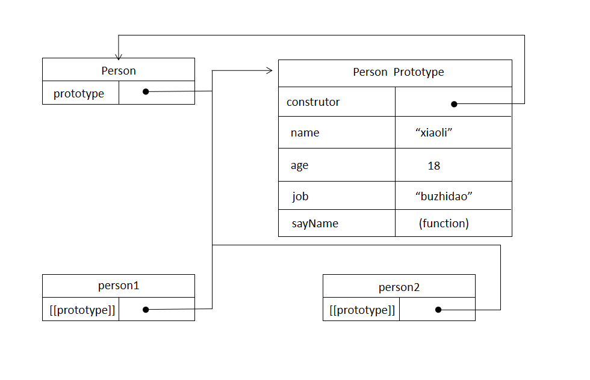
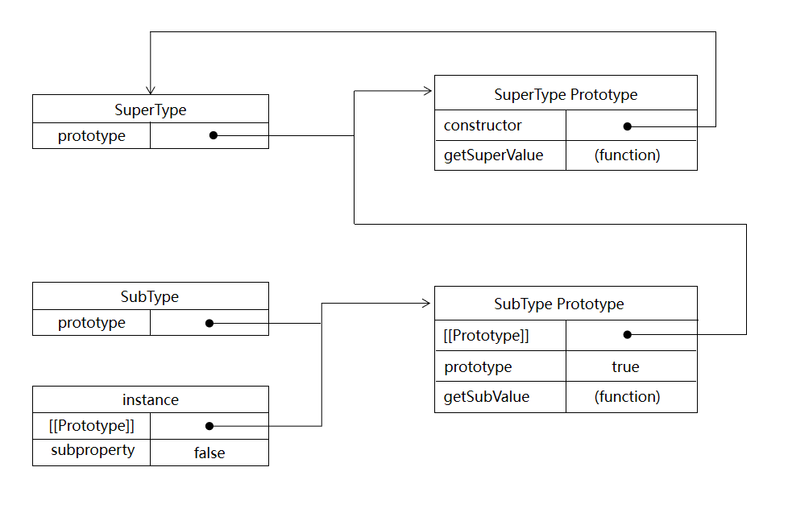
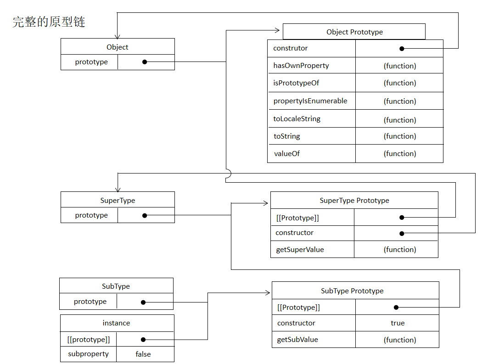

# 面向对象
## 理解对象
之前已经讲过，创建自定义对象的最简单方式就是创建一个Object的实例，然后再为它添加属性和方法，如下所示：
```js
  var person = new Object();
  person.name = "xiaoli";
  person.age = "21";
  person.job = "buzhidao";
  person.sayName = function() {
    alert(this.name);
  }
```
上面的例子创建了一个名为person的对象，并为它添加了三个属性（name、age和job）和一个方法（sayName()）。其中，sayName()方法用于显示this.name（将被解析为person.name）的值。早期的JavaScript开发人员经常使用这个模式创建新对象。几年后，对象字面量成为创建这种对象的首选模式。前面的例子用对象字面量语法可以写成这样：
```js
  var person = {
    name: "xiaoli",
    age: 21,
    job: "buzhidao",
    sayName:function() {
      console.log(this.name);
    }
  }
```
这个例子中的person对象与前面例子中的person对象是一样的，都有相同的属性和方法。这些属性在创建时都带有一些特征值，JavaScript通过这些特征值来定义它们的行为。
### 属性类型
#### ECMAScript中有两种属性：数据属性和访问器属性。"[[]]"指的是内部值
#### 数据属性
数据属性包含一个数据值的位置。在这个位置可以读取和写入值。数据属性有4个描述其行为的特性。
  1. **[[Configurable（可配置）]]**：表示能否通过delete删除属性从而重新定义属性，能否修改属性
  的特性，或者能否把属性修改为访问器属性。像前面的例子中那样直接在对象上定义的属性，它们
  的这个默认值为true。
  2. **[[Enumerable（可枚举）]]**：表示能否通过for-in循环返回属性。像前面例子中那样直接在对象
  上定义的属性，它们的这个特性默认值为true。
  3. **[[Writable（可写的）]]**：表示能否修改属性的值。像前面例子中那样直接在对象上定义的属性，
  它们的这个特征默认值为true。
  4. **[[Value（值）]]**：包含这个属性的数据值。读取属性值的时候，从这个位置读；写入属性值的时
  候，把新值保存在这个位置。这个特性的默认值为undefined。

要修改属性默认的特性，必须使用ECMAScript5的**Object.defineProperty()方法**。这个方法接
收三个参数：属性所在的对象、属性的名字和一个描述符对象。其中，描述符对象的属性必须是：
configurable，enumerable，writable和value。设置其中的一或多个值，可以修改对应的特性
值。例如：
```js
  var person = {};
  Object.defineProperty(person,"name",{
    writable:false,
    value:"xiaoli"
  })
  alert(person.name); // xiaoli
  person.name = "小李";
  alert(person.name); // xiaoli
```
这个例子创建了一个名为name的属性，它的值"xiaoli"是只读的。这个属性的值是不可修改的，如
果尝试为它指定的新值，则在非严格模式下，赋值操作将被忽略；在严格模式下，赋值操作将会导致
抛出错误。
  类似的规则也适用于不可配置的属性。例如：
```js
  var person = {};
  Object.defineProperty(person,"name",{
    configurable: false,
    value: "xiaoli"
  });
  console.log(person.name); // "xiaoli"
  delete person.name;
  console.log(person.name); // "xiaoli"
```
把configurable设置为false，表示不能从对象中删除属性。如果对这个属性调用delete，则在非
严格模式下什么也不会发生，而在严格模式下会导致错误。而且，一旦把属性定义为不可配置的，就
不能再把它变回可配置了，此时，再调用Object.defineProperty()方法修改除writable之外的特
性，都会导致错误：
```js
  var person = {};
  Object.defineProperty(person,"name",{
    configurable:false,
    value:"xiaoli"
  });
  // 报错
  Object.defineProperty(person,"name",{
    configurable:true,
    value:"xiaohong"
  });
```
也就是说，可以多次调用Object.defineProperty方法修改同一个属性，但在把configurable特性
设置为false之后就会有限制了。
在调用Object.defineProperty()方法创建一个新的属性时，如果不指定，configurable、enumerable
和writable特性的默认值都是false。如果调用Object.defineProperty()方法只是修改已定义的属性的
特性，则无此限制。多数情况下，可能都没有必要利用Object.defineProperty()方法提供的这些高级功
能。不过，理解这些概念对理解JavaScript对象却非常有用。
#### 访问器属性
访问器属性不包含数据值；它们包含一对儿**getter和setter**函数（不过，这两个函数都不是必需的）。在读取访问器属性时，会调用getter函数，这个函数负责返回有效的值；在写入访问器属性时，会调用setter函数并传入新值，这个函数负责决定如何处理数据。访问器属性有如下4个特征。
  1. **[[Configurable（可配置）]]**：表示能否通过delete删除属性从而重新定义属性，能否修改属性的特性，
  或者能否把属性修改为数据属性。对于直接在对象上定义的属性，这个特征的默认值为true。
  2. **[[Enumerable（可枚举）]]**：表示能否通过for-in循环返回属性。对于直接在对象上定义的属性，这个特性的默认值为true。
  3. **[[get]]**：在读取属性时调用函数。默认值为undefined。
  4. **[[set]]**：在写入属性时调用的函数。默认值为undefined。


访问器属性不能直接定义，必须使用Object.defineProperty()来定义。请看下面的例子。
```js
var book = {
  _year: 2004,
  edition: 1
};
Object.defineProperty(book, "year", {
  get:function() {
    return this._year
  },
  set:function(newValue) {
    if (newValue > 2004) {
      this._year = newValue;
      this.edition += newValue - 2004;
    }
  }
});
book.year = 2005;
console.log(book.edition); // 2
```
以上代码创建了一个book对象，并给它定义两个默认的属性：_year和edition。_year前面的下划线是一种常用的记号，用于表示只能通过对象方法访问的属性。而访问器属性year则包含一个getter函数和setter函数。getter函数返回_year的值，setter函数通过计算来确定正确的版本。因此，把year属性修改为2005会导致_year变成2005，而edition变为2。这是使用访问器属性的常见方式，即设置一个属性的值会导致其他属性发生变化。
### 定义多个属性
由于为对象定义多个属性的可能性很大，ECMAScript5又定义了一个Object.defineProperties()方法。利用这个方法可以通过描述一次定义多个属性。这个方法接收两个对象参数：第一个对象是要添加和修改其属性的对象，第二个对象的属性与第一个对象中要添加或者修改属性一一对应。例如：
```js
var book = {};
Object.defineProperties(book, {
  _year: {
    writable: true,
    value: 2004
  },
  edition: {
    writable: true,
    value: 1
  },
  year: {
    get: function() {
      return this._year
    },
    set: function(newValue) {
      if (newValue > 2004) {
        this._year = newValue;
        this.edition += newValue - 2004;
      }
    }
  }
});
book.year = 2005;
console.log(book.edition); // 2
```
以上代码在book对象上定义了两个数据属性（_year和edition）和一个访问器属性（year）。最终的对象与之前中定义的对象相同。唯一的区别是这里的属性都是在同一时间创建的。
### 读取属性的特性
使用ECMAScript5的**Object.getOwnPropertyDescriptor()方法**，可以取得给定属性的描述符。这个方法接收两个参数：属性所在的对象和要读取其描述符的属性名称。返回值是一个对象，如果是访问器属性，这个对象的属性有**configurable、enumerable、get和set**；如果是数据属性，这个对象的属性有**configurable、enumerable、writable和value**。例如：
```js
var book = {};
Object.defineProperties(book, {
  _year: {
    value: 2004
  },
  edition: {
    value: 1
  },
  year: {
    get: function() {
      return this._year;
    },
    set: function(newValue) {
      if (newValue > 2004) {
        this._year = newValue;
        this.edition += newValue - 2004;
      }
    }
  }
});
var descriptor = Object.getOwnPropertyDescriptor(book, "_year");
console.log(descriptor.value); // 2004
console.log(descriptor.configurable); // false
console.log(typeof descriptor.get); // undefined

var descriptor = Object.getOwnPropertyDescriptor(book, "year");
console.log(descriptor.value); // undefined
console.log(descriptor.enumerable); // false
console.log(typeof descriptor.get); // "function"
```
对于数据属性_year，value等于最初的值，configurable是false，而get等于undefined。对于访
问器属性year，value等于undefined，enumberable是false，而get是一个指向getter函数的指针。
## 创建对象
虽然Object构造函数或对象字面量都可以用来创建单个对象，但这些方式有个明显的缺点：使用同一个接口创建很多对象，会产生大量的重复代码。为解决这个问题，人们开始使用工厂模式的一种变体。
### 工厂模式
**工厂模式**是软件工程领域一种广为人知的设计模式，这种模式抽象了创建具体对象的过程（后面会讨论其他设计模式及其在JavaScript中的实现）。考虑到在ECMAScript中无法创建类，开发人员就发明了一种函数，用函数来封装以特定接口创建对象的细节，如下面的例子所示。
```js
function createPerson(name, age, job) {
  var o = new Object();
  o.name = name;
  o.age = age;
  o.job = job;
  o.sayName = function() {
    console.log(this.name)
  }
  return o;
}
var person1 = createPerson("xiaoli", 21, "buzhidao");
var person2 = createPerson("xiaoyan", 22, "zhidao");
console.log(person1);
console.log(person2);
```
函数createPerson()能够根据接受的参数来构建一个包含所有必要信息的Person对象。可以无数次地调用这个
函数，而每次它都会返回一个包含三个属性一个方法的对象。工厂模式虽然解决了创建多个相似对象的问题，但
却没有解决对象识别的问题（即怎样知道一个对象的类型）。随着JavaScript的发展，又一个新模式出现了。
### 构造函数模式
前面介绍过，ECMAScript中的构造函数可用来创建特定类型的对象，像Object和Array这样的原生构造函数，在运行时会自动出现在执行环境中，此外，也可以创建自定义的构造函数，从而定义自定义对象类型的属性和方法。例如，可以使用构造函数模式将前面的例子重写如下：
```js
function Person(name, age ,obj) {
  this.name = name;
  this.age = age;
  this.obj = obj;
  this.sayName = function() {
    console.log(this.name);
  }
}
var person1 = new Person("xiaoli", 21, "buzhidao");
var person2 = new Person("xiaoyan", 22, "zhidao");
console.log(person1);
console.log(person2);
```
在这个例子中，Person()函数取代了createPerson()函数。我们注意到，Person()中的代码除了与createPerson()中相同的部分外，还存在以下不同之处：
1.  **没有显式地创建对象；**
2.  **直接将属性和方法赋给了this对象；**
3.  **没有return语句。**

此外，还应该注意到函数名Person使用的是大写字母P。按照惯例，构造函数始终都应该以一个大写字母开头，而非构造函数则应该以一个小写字母开头。这个做法借鉴自其他OO语言，主要是为了区别于ECMAScript中的其他函数；因为构造函数本身也是函数，只不过可以用来创建对象而已。要创建Person的新实例，**必须使用new操作符**。以这种方式调用构造函数实际上会经历以下4个步骤：
1. **创建一个新对象；**
2. **将构造函数的作用域赋给新对象（因此this就指向了这个新对象）；**
3. **执行构造函数中的代码（为这个新对象添加属性）；**
4. **返回新对象。**

在前面例子的最后，person1和person2分别保存着Person的一个不同的实例。这两个对象都有一个constructor
（构造函数）属性，该属性指向Person，如下所示。
```js
function Person(name, age, obj) {
  this.name = name;
  this.age = age;
  this.obj = obj;
  this.sayName = function() {
      console.log(this.name);
    }
}
var person1 = new Person("xiaoli", 21, "buzhidao");
var person2 = new Person("xiaoyan", 22, "zhidao");
console.log(person1.constructor === Person); // true
console.log(person2.constructor === Person); // true
```
对象的constructor属性最初是用来标识对象类型的。但是，提到检测对象类型，还是instanceof操作符要更可靠一些。我们在这个例子中创建的所有对象既是Object的实例，同时也是Person的实例，这一点通过instanceof操作符可以得到验证。
```js
function Person(name, age, obj) {
  this.name = name;
  this.age = age;
  this.obj = obj;
  this.sayName = function() {
    console.log(this.name);
  }
}
var person1 = new Person("xiaoli", 21, "buzhidao");
var person2 = new Person("xiaoyan", 22, "zhidao");
console.log(person1 instanceof Object); // true
console.log(person2 instanceof Object); // true
console.log(person1 instanceof Person); // true
console.log(person2 instanceof Person); // true
```
创建自定义的构造函数意味着将来可以将它的实例标识为一种特定的类型；而这正是构造函数模式胜过工厂模式的地方。在这个例子中，person1和person2之所以同时是Object的实例，是因为所有对象均继承自Object。
### 将构造函数当作函数
构造函数与其他函数的唯一区别，就在于调用它们的方式不同。不过构造函数毕竟也是函数，不存在定义构造函数的特殊语法。任何函数，只要通过new操作符来调用，那它就可以作为构造函数；而任何函数，如果不通过new操作符来调用，那它跟普通函数也不会有什么两样。例如，前面例子中定义的Person()函数可以通过下列任何一种方式来调用。
```js
  function Person(name, age, job) {
    this.name = name;
    this.age = age;
    this.job = job;
    this.sayName = function() {
      console.log(this.name);
    };
  }
  var person = new Person("xiaoli", 21, "buzhidao");
  person.sayName(); // xiaoli

  Person("xiaowang", 22, "buzhidao");
  window.sayName(); // xiaohuang

  var o = new Object();
  Person.call(o, "xiaoming", 23, "zhidao");
  o.sayName(); // xiaoming
```
这个例子中的前两行代码展示了构造函数的典型用法，即使用new操作符来创建一个新对象。接下来的两行代码展示了不使用new操作符调用Person()会出现什么结果：属性和方法都被添加给window对象了。之前讲过，当在全局作用域中调用一个函数时，this对象总是指向Global对象（在浏览器中就是window对象）。因此，在调用完函数之后，可以通过window对象来调用sayName()方法，并且还返回
了"xiaowang"。最后，也可以使用**call()（或者apply()**）在某个特殊对象的作用域中调用Person()函数。这里是在对象o的作用域中调用的，因此调用o后就拥有了所有属性和sayName()方法。
#### 构造函数问题
构造函数模式虽然好用，但也并非没有缺点。使用构造函数的主要问题，就是每个方法都要在每个实例上重新创建一遍。在前面的例子中，person1和person2都有一个名为sayName()的方法，但那两个方法不是同一个Function的实例。不要忘了---ECMAScript中的函数是对象。因此每定义一个函数，也就是实例化了一个对象。从逻辑角度讲，此时的构造函数也可以这样定义。
```js
function Person(name, age, job) {
  this.name = name;
  this.age = age;
  this.job = job;
  this.sayName = new Function("alert(this.name)"); // 声明函数在逻辑上是等价的
}
var person1 = new Person("xiaoli", 21, "buzhidao");
person1.sayName(); // xiaoli
```
从这个角度上来看构造函数，更容易明白每个Person实例都包含一个不同的Function实例（以显示name属性）的本质。说明白些，以这种方式创建函数，会导致不同的作用域链和标识符解析，但创建Function新实例的机制仍然是相同的。因此，不同实例上的同名函数是不相等的，以下代码可以证明这一点。
```js
  console.log(person1.sayName == person2.sayName); // false
```
然而，创建两个完成同样任务的Function实例的确没有必要；况且有this对象在，根本不用执行代码前就把函数绑定到特定对象上面。因此，大可像下面这样；通过把函数定义转移到构造函数外部来解决这个问题。
```js
function Person(name, age, job) {
  this.name = name;
  this.age = age;
  this.job = job;
  this.sayName = sayName;
}
function sayName() {
  alert(this.name);
}
var person1 = new Person("xiaoli", 21, "buzhidao");
var person2 = new Person("xiaoyan", 22, "zhidao");
console.log(person1);
console.log(person2);
person1.sayName();
person2.sayName();
```
在这个例子中，我们把sayName()函数定义转移到了构造函数外部。而在构造函数内部，我们将sayName属性设置成等于全局的sayName函数。这样一来，由于sayName包含的是一个指向函数的指针，因此perosn1和person2对象就共享了再全局作用域中定义的同一个sayName()函数。这样做确实解决了两个函数做同一件事的问题，可是新问题又来了：在全局作用域中定义的函数实际上只能被某个对象调用，这让全局作用域有点名不副实。而更让人无法接受的是：如果对象需要定义很多方法，那么就要定义很多个全局函数，于是我们这个自定义的引用类型就丝毫没有封装性可言了。好在，这些问题可以通过使用原型模式来解决。
### 原型模式
我们创建的每一个函数都有一个**prototype（原型）属性**，这个属性是一个指针，指向一个对象，而这个对象的用途是包含可以由特定类型的所有实例共享的属性和方法。如果按照字面意思来理解，那么**prototype**就是通过调用构造函数而创建的那个对象实例的原型对象。使用原型对象的好处是可以让所有对象实例共享它所包含的属性和方法。换句话说，不必在构造函数中定义对象实例的信息，而是可以将这些信息直接添加到原型对象中，如下面的例子所示。
```js
  function Person() {
  }
  Person.prototype.name = "xiaoli";
  Person.prototype.age = 18;
  Person.prototype.job = "buzhidao";
  Person.prototype.sayName = function() {
    console.log(this.name);
  }
  var person1 = new Person();
  person1.sayName(); // xiaoli
  console.log(person1);

  var person2 = new Person();
  person2.sayName();
  console.log(person1.sayName == person2.sayName); // true
```
在此，我们将sayName()方法和所有属性直接添加到了Person的prototype属性中，构造函数变成了空函数。即使如此，也仍然可以通过调用构造函数来创建新对象，而且新对象还会具有相同的属性和方法。但与构造函数模式不同的是，新对象的这些属性和方法是由所有实例共享的。换句话说，person1和person2访问的都是同一组属性和同一个sayName()函数。要理解原型模式的工作原理，必须先理解ECMAScript中原型对象的性质。
#### 理解原型对象
无论什么时候，只要创建了一个新函数，就会根据一组特定的规则为该函数创建一个prototype属性，这个属性指向函数的原型对象，在默认情况下，所有原型对象都会自动获取一个constructor（构造函数）属性，这个属性是一个指向prototype属性所在函数的指针。就拿前面的例子来说，Person.prototype.constructor指向Person。而通过这个构造函数，我们还可继续为原型对象添加其他属性和方法。

创建了自定义的构造函数之后，其原型对象默认只会取得constructor属性；至于其他方法，则都是从Object继承而来的。当调用构造函数创建一个新实例后，该实例的内部将包含一个指针（内部属性），指向构造函数的原型对象。在ECMAScript5中管这个指针叫[[Prototype]]。虽然脚本中没有标准的方式访问[[Prototype]]，但在Firefox、Safari和Chrome在每个对象上都支持一个属性__proto__；而在其他实现中，这个属性对脚本则是完全不可见的。不过，要明确的真正重要的一点就是，这个连接存在于实例于构造函数的原型对象之间，而不是存在于实例于构造函数之间。

在6.2.png展示了Person构造函数、Person的原型属性以及Person现有的两个实例之间的关系。在此，Person.prototype指向了原型对象，而Person.prototype.constructor又指回了Person。原型对象中除了包含constructor属性之外，还包括后来添加的其他属性。Person的每个实例----person1和person2都包含一个内部属性，该属性仅仅指向了Person.prototype；换句话说，它们与构造函数没有直接的关系。此外，要格外注意的是，虽然这两个实例都不包含属性和方法。但我们却可以调用person1.sayName()。这是通过查找对象属性的过程来实现的。

虽然在所有实现中都无法访问[[Prototype]]，但通过isPrototypeOf()方法来确定对象之间是否存在这种关系。从本质上讲，如果[[Prototype]]指向调用isPrototypeOf()方法的对象（Person.Prototype），那么这个方法就返回true，如下所示：
```js
console.log(Person.prototype.isPrototypeOf(person1)); // true
console.log(Person.prototype.isPrototypeOf(person2)); // true
```
这里，我们用原型对象的isPrototypeOf()方法测试了person1和person2。因为它们内部都有一个指向Person.prototype的指针，因此都返回了true。ECMAScript5增加了一个新方法，叫Object.getPrototypeOf()，在所有支持的实现中，这个方法返回[[Prototype]]的值。例如：
```js
console.log(Object.getPrototypeOf(person1) == Person.prototype); // true
console.log(Object.getPrototypeOf(person1).name); // xiaoli
```
这里的第一行代码只是确定Object.getPrototypeOf()返回的对象实际就是这个对象的原型。第二行代码取得了原型对象中job属性的值，也就是"WEB Front End Engineer"。使用Object.getPrototypeOf()可以方便地取得一个对象的原型，而这在利用原型实现继承（后面会讨论）的情况下是非常重要的。

每当前代码读取某个对象的某个属性时，都会执行一次搜索，目标是具有给定名字的属性。搜索首先从对象实例本身开始。如果在实例中找到了具有给定名字的属性，则返回该属性的值；如果没有找到，则继续搜索指针指向的原型对象，在原型对象中查找具有给定名字的属性。如果在原型对象中找到了这个属性，则返回该属性的值。也就是说，在我们调用person1.sayName()的时候，会先后执行两次搜索。首先，解析器会问：“实例person1有sayName属性吗？” 答：“没有。”然后，它会继续搜索，再问：“person的原型有sayName属性吗？”答：“有。”于是，它就读取那个保存在原型对象中的函数。当我们调用person2.sayName()时，将会重现相同的搜索过程，得到相同的结果。而这正是多个对象实例共享原型保存的属性和方法的基本原理。

虽然可以通过对象实例访问保存在原型中的值，但却不能通过对象实例重写原型中的值。如果我们在实例中添加了一个属性，而该属性与实例原型中的一个属性同名，那我们就在实例中创建该属性，该属性将会屏蔽原型中的那个属性。来看下面的例子。
```js
function Person() {}
Person.prototype.name = "xiaoli";
Person.prototype.age = 18;
Person.prototype.job = "WEB Front End Engineer";
Person.prototype.sayName = function() {
  console.log(this.name);
};
var person1 = new Person();
var person2 = new Person();
person1.name = "xiaohong";
console.log(person1.name); // xiaohong --来自实例
console.log(person2.name); // xiaoli --来自原型
```
在这个例子中，person1的name被一个新值给屏蔽了。但无论访问person1.name还是访问person2.name都能够正常地返回值，即分别是"xiaohong"（来自对象实例）和"xiaoli"（来自原型）。当在console.log中访问person1.name时，需要读取它的值，因此就会在这个实例上搜索一个名为name的属性。这个属性确实存在，于是就返回他的值而不必要再搜索原型了。当以同样的方式访问person2.name时，并没有在实例上发现该属性，因此就会继续搜索原型，结果在那里找到了name属性。当为对象实例添加一个属性时，这个属性就会屏蔽原型对象中保存的同名属性；换句话说，添加这个属性只会阻止我们访问原型中的那个属性，但不会修改那个属性。即使将这个属性设置为null，也只会在实例中设置这个属性，而不会恢复其指向原型的连接。不过，使用delete操作符则可以完全删除实例属性，从而让我们能够重新访问原型中的属性，如下所示。
```js
function Person() {}
Person.prototype.name = "xiaoli";
Person.prototype.age = 18;
Person.prototype.job = "WEB Front End Engineer";
Person.prototype.sayName = function() {
  console.log(this.name);
};
var person1 = new Person();
var person2 = new Person();
person1.name = "xiaohong";
console.log(person1.name); // xiaohong --来自实例
console.log(person2.name); // xiaoli --来自原型
delete person1.name;
console.log(person1.name); // xiaoli --来自原型
```
在这个修改后的例子中，我们使用delete操作符删除了person1.name，之前它保存的"xiaohong"值屏蔽了同名的原型属性。把它删除以后，就恢复了对原型中name属性的连接。因此，接下来再调用person1.name时，返回的就是原型中name属性的值了。

使用**hasOwnProperty()方法**可以检测一个属性是存在于实例中，还是存在原型中。这个方法（不要忘了他是从Object继承来的）只是给定属性存在于对象实例中时，才会返回true。来看下面这个例子。
```js
function Person() {};
Person.prototype.name = "xiaoli";
Person.prototype.age = 18;
Person.prototype.job = "WEB Front End Engineer";
Person.prototype.sayName = function() {
  console.log(this.name);
};
var person1 = new Person();
var person2 = new Person();
console.log(person1.hasOwnProperty("name")); // false

person1.name = "xiaohong";
console.log(person1.name); // xiaohong 来自实例
console.log(person1.hasOwnProperty("name")); // true

delete person1.name;
console.log(person1.name); // xiaoli 来自原型
console.log(person1.hasOwnProperty("name")); // false
```
通过使用hasOwnProperty()方法，什么时候访问的是实例属性，什么时候访问的是原型属性就一清二楚了。调用person1.hasOwnProperty("name")时，只有当person1重写属性后才会返回true，因为只有这时候才是一个实例属性，而非原型属性。
#### 原型与in操作符
有两种方式使用in操作符：单独使用和在for-in循环中使用。在单独使用时，in操作符会在通过对象能够访问给定属性是返回true，无论该属性存在于实例中还是原型中。看一看下面的例子。
```js
function Person() { }
Person.prototype.name = "xiaoli";
Person.prototype.age = 18;
Person.prototype.job = "WEB Front End Engineer";
Person.prototype.sayName = function () {
  console.log(this.name);
}
var person1 = new Person();
var person2 = new Person();

console.log(person1.hasOwnProperty("name")); //false
console.log("name" in person1); // true

person1.name = "xiaohong";
console.log(person1.name); // xiaohong --来自实例
console.log(person1.hasOwnProperty("name")); // true
console.log("name" in person1); // true

console.log(person2.name); // xiaoli --来自原型
console.log(person2.hasOwnProperty("name")); // false
console.log("name" in person2); // true

delete person1.name;
console.log(person1.name); // xiaoli --来自原型
console.log(person1.hasOwnProperty("name")); // false
console.log("name" in person1); // true
```
在以上代码执行的整个过程中，name属性要么是直接在对象上访问到的，要么是通过原型访问到的。因此，调用"name" in person1始终返回true，无论该属性存在于实例中还是存在于原型中。同时使用hasOwnProperty()方法和in操作符，就可以确定该属性到底是存在于对象中，还是存在于原型中，如下所示。
```js
function hasPrototypeProperty(object, name) {
  return !Object.hasOwnProperty(name) && (name in object);
}
```
由于in操作符只要通过对象能够访问到属性就返回true，hasOwnProperty()只在属性存在于实例中时才返回true，因此只要in操作符返回true而hasOwnProperty()返回false，就可以确定属性是原型中的属性。下面来看一看上面定义的函数hasPrototypeProperty()的用法。
```js
function hasPrototypeProperty(object, name) {
  return !object.hasOwnProperty(name) && (name in object);
};
function Person() {}
Person.prototype.name = "xiaoli";
Person.prototype.age = 18;
Person.prototype.job = "Web Front End Engineer";
Person.prototype.sayName = function() {
  console.log(this.name);
};
var person1 = new Person();
console.log(hasPrototypeProperty(person1, "name")); // true

person1.name = "xiaohong";
console.log(hasPrototypeProperty(person1, "name")); // false
```
在这里，name属性先是存在原型中，因此hasPrototypeProperty()返回true。当在实例中重写name属性后，该属性就存在于实例中，因此hasPrototypeProperty()返回false。即使原型中仍然有name属性，但由于现在实例中也有了这个属性，因此原型中的name属性就用不到了。

使用for-in循环时，返回的是所有能够通过对象访问的、可枚举的（enumerated）属性，其中既包含存在与实例中的属性，也包括存在于原型中的属性。
```js
function Person() {};
Person.prototype.name = "xiaoli";
Person.prototype.age = 18;
Person.prototype.job = "Web Front End Engineer";
Person.prototype.sayName = function() {
  console.log(this.name);
}
for (const i in Person.prototype) {
  console.log(i);
}
```
要取得对象上所有可枚举的实例属性，可以使用ECMAScript5的**Object.keys()方法**。这个方法接收一个对象作为参数，返回一个包含所有可枚举属性的字符串数组。例如：
```js
  function Person() {};
  Person.prototype.name = "xiaoli";
  Person.prototype.age = 18;
  Person.prototype.job = "Web Front End Engineer";
  Person.prototype.sayName = function() {
    console.log(this.name);
  };
  var keys = Object.keys(Person.prototype);
  console.log(keys); // "name, age, job, sayName";

  var person1 = new Person();
  person1.name = "xiaohong";
  person1.age = 20;
  var person1Keys = Object.keys(person1);
  console.log(person1Keys); // "name, age"
```
这里，变量keys中将保存一个数组，数组中时字符串"name"、"age"、"job"和"sayName"。这个顺序也是它们在for-in循环中出现的顺序。如果是通过Person的实例调用，则Object.keys()返回的数组只包含"name"和"age"这两个实例属性。

如果你想要得到所有实例属性，无论它是否可枚举，都可以使用**Object.getOwnPropertyNames()方法**。
```js
  function Person() {};
  Person.prototype.name = "xiaoli";
  Person.prototype.age = 18;
  Person.prototype.job = "Web Front End Engineer";
  Person.prototype.sayName = function() {
    console.log(this.name);
  };
  var keys = Object.getOwnPropertyNames(Person.prototype);
  console.log(keys); // "constructor, name, age, job, sayName"
```
注意结果中包含了不可枚举的constructor属性。Object.keys()和Object.getOwnPropertyNames()
方法都可以用来代替for-in循环。
#### 更简单的原型语法
前面的例子中每添加一个属性和方法就要敲一遍Person.prototype。为减少不必要的输入，也为了从视觉上更好地封装原型的功能，更常见的做法是用一个包含所有属性和方法的对象字面量来重写整个原型对象，如下面的例子所示。
```js
function Person() {};
Person.prototype = {
  name: "xiaoli",
  age: 18,
  job: "Web Front End Engineer",
  sayName: function() {
    console.log(this.name);
  }
};
```
在上面的代码中，我们将Person.prototype设置为等于一个以对象字面量形式创建的新对象。最终结果相同，但有一个例外：constructor属性不再指向Person了，前面介绍过，每创建一个函数，就会同时创建它的prototype对象，这个对象也会自动获得constructor属性。而我们在这里使用的语法，本质上完全重写了默认的prototype对象，因此constructor属性也就变成了新对象的constructor属性（指向Object构造函数），不再指向Person函数。此时，尽管instanceof操作符还能返回正确的结果，但通过constructor已经无法确定对象的类型了，如下所示。
```js
function Person() {};
Person.prototype = {
  name: "xiaoli",
  age: 18,
  job: "Web Front End Engineer",
  sayName: function() {
    console.log(this.name);
  }
};
var friend = new Person();

console.log(friend instanceof Object); // true
console.log(friend instanceof Person); // true
console.log(friend.constructor == Person); // false
console.log(friend.constructor == Object); // true
```
在此，用instanceof操作符测试Object和Person仍然返回true，但constructor属性则等于Object而不等于Person了。如果constructor的值真的很重要，可以像下面这样特意将它设置回适当的值。
```js
  function Person() {};
  Person.prototype = {
    constructor: Person,
    name: "xiaoli",
    age: 18,
    job: "Web Front End Engineer",
    sayName: function () {
      console.log(this.name);
    }
  };
  var friend = new Person();
```
注意，以这种方式重设constructor属性会导致它的[[Enumerable]]特性被设置为true。默认情况下，原生的constructor属性是不可枚举的，可以试一试**Object.defineProperty()。**
```js
function Person() {};
Person.prototype = {
  name: "xiaoli",
  age: 18,
  job: "Web Front End Engineer",
  sayName: function() {
    console.log(this.name);
  }
};
Object.defineProperty(Person.prototype, "constructor", {
  enumerable: false,
  value: Person
})
```
#### 原型的动态性
由于在原型中查找值的过程是一次搜索，因此我们对原型对象所做的任何修改都能够立即从实例上
反映出来----即使是先创建了实例后修改原型也照样如此。请看下面的例子。
```js
function Person() {};
  Person.prototype = {
    name: "xiaoli",
    age: 18,
    job: "Web Front End Engineer",
    sayName: function() {
      console.log(this.name);
    }
  };
  
  var frined = new Person();
  Person.prototype.sayHi = function() {
    console.log("hi");
  };
  frined.sayHi(); // hi
```
以上代码先创建了Person的一个实例。并将其保存在friend中。然后，下一条语句在Person.prototype
中添加了一个方法sayHi()。即使friend实例是在添加新方法之前创建的，但它仍然可以通过访
问这个新方法。其原因可以归结为实例与原型之间的松散连接关系。当我们调用friend.sayHi()
时，首先会在实例中搜索名为sayHi的属性，在没有找到的情况下，会继续搜索原型。因为实例与
原型之间的连接只不过是一个指针，而非一个副本，因此就可以在原型中找到新的sayHi属性并返
回保存在那里的函数。

尽管可以随时为原型添加属性和方法，并且修改能够立即在所有对象实例中反映出来，但如果重写整个对象，那么情况就不一样了。我们知道，调用构造函数时会为实例添加一个指向最初原型的[[Prototype]]指针，而把原型修改为另一个对象就等于切断了构造函数与最初原型之间的联系。请记住：实例中的指针仅指向原型，而不指向构造函数。请看下面的例子：
```js
function Person() {};
var friend = new Person();

Person.prototype = {
  constructor: Person,
  name: "xiaoli",
  age: 18,
  job: "Web Front End Engineer",
  sayName: function() {
    console.log(this.name);
  }
};

friend.sayName(); // error
```
#### 原生对象的原型
原型模式的重要性不仅体现在创建自定义类型方面，就连所有原生的引用类型，都是采用这种模式创建的。所有原生引用类型（Object、Array、String，等等）都在其构造函数的原型上定义了方法。例如在Array.prototype中可以找到sort()方法，而在String.prototype中可以找到substring()方法，如下所示。
```js
console.log(typeof Array.prototype.sort); // function
console.log(typeof String.prototype.substring); // function
```
通过原生对象的原型，不仅可以取得所有默认方法的引用，而且也可以定义新方法。可以像修改自定义对象的原型一样修改原生对象的原型，因此可以随时添加方法。下面的代码就给基本包装类型String添加了一个名为startsWith的方法。
```js
String.prototype.startsWith = function(text) {
  return this.indexOf(text) == 0;
};
var msg = "Hello world";
console.log(msg.startsWith("Hello")); // true
```
这里新定义的startsWith()方法会在传入的文本位于一个字符串开始时返回true。既然方法被添加给了String.prototype，那么当前环境中的所有字符串就都可以调用它。由于msg是字符串，而且后台会调用String基本包装函数创建这个字符串，因此通过msg就可以调用startsWith()方法。
#### 原型对象的问题
原型模式也不是没有缺点。首先，它省略了为构造函数传递初始化参数这一环节，结果所有实例在默认情况下都将取得相同的属性值。虽然这会在某种程度上带来一些不方便，但还不是原型的最大问题。原型模式的最大问题是由其共享的本性所导致的。原型中所有属性时被很多实例共享的，这种共享对于函数非常合适。对于那些包含基本值的属性倒也说得过去，毕竟（如前面的例子所示），通过在实例上添加一同名属性，可以隐藏原型中的对应属性。然而，对于包含引用类型值的属性来说，问题就比较突出了。来看下面的例子。
```js
function Person() {};
Person.prototype = {
  constructor: Person,
  name: "xiaoli",
  age: 29,
  job: "Web Front End Engineer",
  friends: ["Shelby", "Court"],
  sayName: function() {
    console.log(this.name);
  }
};

var person1 = new Person();
var person2 = new Person();

person1.friends.push("Van");

console.log(person1.friends); // "Shelby, Court, Van"
console.log(person2.friends); // "Shelby, Court, Van"
console.log(person1.friends == person1.friends); // true
```
在此，Person.prototype对象有一个名为friends的属性，该属性包含一个字符串数组。然后，创建了Person的两个实例。接着，修改了person1.friends引用的数组，向数组中添加了一个字符串。由于friends数组存在于Person.prototype而非person1中，所以刚刚提到的修改也会通过person2.friends（与person1.friends指向同一个数组）反映出来。假如我们的初衷就是像这样在所有实例中共享一个数组。可是，实例一般都是要有属于自己的全部属性。而这个问题正是我们很少看到有人单独使用原型模式的原因所在。
### 组合使用构造函数模式和原型模式
创建自定义类型的最常见方式，就是组合构造函数模式与原型模式。构造函数模式用于定义实例属性，而原型模式用于定义方法和共享的属性。结果，每个实例都会有自己的一份实例属性的副本，但同时又共享着对方法的引用，最大限度地节省了内存。另外，这种混成模式还支持向构造函数传递参数；可谓是集两种模式之长。下面的代码重写了前面的例子。
```js
  function Person(name, age, job) {
    this.name = name;
    this.age = age;
    this.job = job;
    this.friends = ["Shelby", "Court"];
  };
  Person.prototype = {
    constructor: Person,
    sayName: function() {
      console.log(this.name);
    }
  };

  var person1 = new Person("xiaoli", 18, "Web Front End Engineer");
  var person2 = new Person("xiaohong", 19, "Doctor");

  person1.friends.push("Van");
  console.log(person1.friends); // "Shelby, Court, Van"
  console.log(person2.friends); // "Shelby, Court"
  console.log(person1.friends == person2.friends); // false
  console.log(person1.sayName == person2.sayName); // true
```
在这个例子中，实例属性都是在构造函数中定义的，而由所有实例共享的属性constructor和方法sayName()则是原型中定义的。而修改了person1.friends（向其中添加一个新字符串），并不会影响到person2.friends，因为它们分别引用了不同的数组。这种构造函数与原型混成的模式，是目前在ECMAScript中使用最广泛、认同度最高的一个种创建自定义类型的方法。可以说，这是用来定义引用类型的一种默认模式。
### 动态原型模式
有其他OO语言经验的开发人员在看到独立的构造函数和原型时，很可能会感到非常困惑。动态原型模式正是解决这个问题的一个方案，它把所有信息都封装在了构造函数中，而通过在构造函数中初始化原型（仅在必要的情况下），又保持了同时使用构造函数和原型的优点。换句话说，可以通过检查某个应该存在的方法是否有效，来决定是否需要初始化原型。来看下一个例子。
```js
function Person(name, age, job) {
  // 属性
  this.name = name;
  this.age = age;
  this.job = job;

  // 方法
  if (typeof this.sayName != "function") {
    Person.prototype.sayName = function() {
      console.log(this.name);
    }
  }
};

var friend = new Person("xiaoli", 18, "Web Front End Engineer");
console.log(friend);
friend.sayName(); // xiaoli
```
这里只在sayName()方法不存在的情况下，才会将它添加到原型中。这段代码只会在初次调用构造函数时才会执行。此后，原型已经完成初始化，不需要再做什么修改了。不过要记住，这里对原型所做的修改，能够立即在所有实例中得到反映。因此，这种方法确实可以说非常完美。其中，if语句检查的可以是初始化之后应该存在的任何属性或方法---不必用一大堆if语句检查每个属性和每个方法；只要检查其中一个即可。对于采用这种模式创建的对象，还可以是用instanceof操作符确定的类型。
:::warning 警告
！切记 使用动态原型模式时，不能使用对象字面量重写原型。前面已经解释过了，如果在已经创建了实例的情况下重写原型，那么就会切断现有实例于新原型之间的联系。
:::
### 寄生构造函数模式
通常，在前述的几种模式都不适用的情况下，可以使用寄生构造函数模式。这种模式的基本思想是创建一个函数，该函数的作用仅仅是封装创建对象的代码，然后再返回新创建的对象；但从表面上看，这个函数又很像是典型的构造函数。下面是一个例子。
```js
function Person(name, age, job) {
  var o = new Object();
  o.name = name;
  o.age = age;
  o.job = job;
  o.sayName = function() {
    console.log(this.name);
  }
  return o;
};
var friend = new Person("xiaoli", 18, "Web Front End Engineer");
friend.sayName(); // xiaoli
```
在这个例子中，Person函数创建了一个新对象，并以相应的属性和方法初始化对象，然后又返回了这个对象。除了使用new操作符并把使用的包装函数叫做构造函数之外，这个模式跟工厂模式其实是一模一样的。构造函数在不返回值的情况下，默认返回新对对象实例。而通过在构造函数的末尾添加一个return语句，可以重写调用构造函数时返回的值。

这个模式可以在特殊的情况下用来为对象创建构造函数。假设我们想创建一个具有额外方法的特殊数组。由于不能修改Array构造函数，因此可以使用这个模式。
```js
function SpecialArray() {
  // 创建数组
  var values = new Array();

  values.push.apply(values, arguments);

  // 添加方法
  values.toPipedString = function() {
    return this.join("|");
  }

  // 返回数组
  return values;
};

var colors = new SpecialArray("red", "blue", "green");
console.log(colors.toPipedString());
```   
在这个例子中，我们创建了一个名叫SpecialArray的构造函数。在这个函数内部，首先创建了一个数组，然后push()方法（用构造函数接收到的所有参数）初始化了数组的值。随后，又给数组实例添加一个toPipedString()方法，该方法返回以竖线分隔的数组值。最后，将数组以函数值的形式返回。接着，我们调用了SpecialArray构造函数，向其中传入了用于初始化数组的值，此后又调用了toPipedString()方法。

关于寄生构造函数模式，有一点需要说明：首先，返回的对象与构造函数或者与构造函数的原型属性之间没有关系；也就是说，构造函数返回的对象与在构造函数外部创建的对象没有什么不同。为此，不能依赖instanceOf操作符来确定对象类型。由于存在上述问题，我们建议在可以使用其他模式的情况下，不要使用这种模式。

### 稳妥构造函数模式
所谓的稳妥对象。指的是没有公共属性，而且其方法也不引用this的对象。稳妥对象最适合在一些安全环境中（这些环境中会禁止使用this和new），或者在防止数据被其他应用程序（如Mashup程序）改动时使用。稳妥构造函数遵循与寄生构造函数类似的模式，但有两点不同：一是新创建对象的实例方法不引用this；二是不使用new操作符调用构造函数。按照稳妥构造函数的要求，可以将前面的
Person构造函数重写如下。
```js
function Person(name, age, job) {
  // 创建需要返回的对象
  var o = new Object();

  // 可以在这里定义私有变量和函数

  // 添加方法
  o.sayName = function() {
    console.log(name);
  }

  return o;
};

var friend = new Person("xiaoli", 18, "Web Front End Engineer");
friend.sayName();
```
这样，变量friend中保存的是一个稳妥对象，而除了调用sayName()方法外，没有别的方式可以访问其数据成员。即使有其他代码会给这个对象添加方法或数据成员，但也不能有别的办法访问传入到构造函数中的原始数据。稳妥构造函数模式提供的这种安全性，使得它非常合适在某些安全执行环境。
## 继承
继承是OO语言中的一个最为人津津乐道的概念。许多OO语言都支持两种继承方式：接口继承和实现继承。接口继承只继承方法签名，而实现继承则继承实际的方法。如前所述，由于函数没有签名，在ECMAScript中无法实现接口继承。ECMAScript只支持实现继承，而且其实现继承主要是依靠原型链来实现的。
### 原型链
ECMAScript中描述了原型链的概念，并将原型链作为实现继承的主要方法。其基本思想是利用原型让一个引用类型继承另一个引用类型的属性和方法。简单回顾一下构造函数、原型和实例的关系：每个构造函数都有一个原型对象，原型对象都包含一个指向构造函数的指针，而实例都包含一个指向原型对象的内部指针。那么假如我们让原型对象等于另一个类型的实例，结果会怎么样呢？显然，此时的原型对象将包含一个指向另一个原型的指针，相应地，另一个原型中也包含着一个指向另一个构造函数的指针。假如另一个原型又是另一个类型的实例，那么上述关系依然成立，如此层层递进，就构成了实例与原型的链条。这就是所谓原型链的基本概念。

实现原型链有一个种基本模式，其代码大致如下。
```js
function SuperType() {
  this.property = true;
};

SuperType.prototype.getSuperValue = function() {
  return this.property;
};

function SubType() {
  this.subproperty = false;
};

// 继承了SuperType
SubType.prototype = new SuperType();

SubType.prototype.getSubValue = function() {
  return this.subproperty;
};

var instance = new SubType();
console.log(instance.getSuperValue()); // true
```
以上代码定义了两个类型：SuperType和SubType。每个类型分别有一个属性和一个方法。它们的主要区别是SubType继承了SuperType，而继承是通过创建SuperType的实例，并将该实例赋给SubType.prototype实现的。实现的本质是重写原型对象，代之以一个新类型的实例。换句话说，原来存在于SuperType的实例中的所有属性和方法，现在也存在于SubType.prototype中了。在确立了继承关系之后，我们给SubType.prototype添加了一个方法，这样就在继承了SuperType的属性和方法的基础上又添加了一个新方法。这个例子中的实例以及构造函数和原型之间的关系如下图所示。

上面的代码中，我们没有使用SubType默认提供的原型，而是给它换了一个新原型；这个原型就是SuperType的实例。于是。新原型不仅具有作为一个SuperType的实例所拥有的全部属性和方法，而且其内部还有一个指针，指向了SuperType的原型。最终结果就是这样：instance指向SubType的原型，SubType的原型又指向SuperType的原型。getSuperValue()方法仍然还在SuperType.prototype中，但property则位于Subtype.prototype中。这是因为property是一个实例属性，而getSuperValue()则是一个原型方法。既然SubType.prototype现在是SuperType的实例，那么property当然就位于该实例中了。此外，要注意instance.constructor现在指向的SuperType，这是因为原来SubType.prototype中的constructor
被重写了的缘故。实际上，不是SubType的原型的constructor属性被重写了，而是SubType的原型指向了另一个对象SuperType的原型，而这个原型对象的constructor属性指向的是SuperType。

通过实现原型链，本质上扩展了前面介绍的原型搜索机制。当以读取模式访问一个实例属性时，首先会在实例中搜索该属性。如果没有找到该属性，则会继续搜索实例的原型。在通过原型链实现继承的情况下，搜索过程就得以沿着原型链继续向上。就拿上面的例子来说，调用instance.getSuperValue()会经历三个搜索步骤：1.搜索实例；>>>2.搜索SubType.prototype；>>>3.搜索SuperType.prototype，最后一步才会找到该方法。在找不到属性或方法的情况下，搜索过程总是要一环一环地前行到原型链末端才会停下来。
#### 别忘记默认的原型
事实上，前面例子中展示的原型链还少一环。我们知道，所有引用类型默认都继承了Object，而这个继承也是通过原型链实现的。大家要记住，所有函数的默认原型都是Object的实例，因此默认原型都会包含一个内部指针这，指向Object.prototype。也正是所有自定义类型都会继承toString()、valueOf()等默认方法的根本原因。所以，我们说上面的例子展示的原型链中还应该包括另外一个继承层次。下图我们展示了该例子中完整的原型链。

一句话，SubType继承了SuperType，而SuperType继承了Object。当调用instance.toString()时，实际上调用的是保存在Object.prototype中的那个方法。
#### 确定原型和实例的关系
可以通过两种方式来确定原型和实例之间的关系。第一种方式是使用**instanceof操作符**，只要用这个操作符来测试实例与原型链中出现过的构造函数，结果就会返回true，以下几行代码就说明了这个一点。
```js
console.log(instance instanceof Object); // true
console.log(instance instanceof SuperType); // true
console.log(instance instanceof SubType); // true
``` 
由于原型链的关系，我们可以说instance是Object、SuperType或SubType中任何一个类型的实例。因此，测试这三个构造函数的结果都返回了true。

第二种方式是使用**inPrototypeOf()方法**。同样，只要是原型链中出现过的原型，都可以说是该原型链所派生的实例的原型，因此isPrototypeOf()方法也会返回true，如下所示。
```js
  console.log(Object.prototype.isPrototypeOf(instance)); // true
  console.log(SuperType.prototype.isPrototypeOf(instance));// true
  console.log(SubType.prototype.isPrototypeOf(instance));// true
```
#### 谨慎地定义方法
子类型有时候需要覆盖超类型中的某个方法，或者需要添加超类型中不存在的某个方法。但不管怎样，给原型添加方法的代码一定要在替换原型的语句之后。来看下面的例子。
```js
function SuperType() {
  this.property = true;
};

SuperType.prototype.getSuperValue = function() {
  return this.property;
};

function SubType() {
  this.subproperty = false;
};

// 继承了SuperType
SubType.prototype = new SuperType();

// 添加新方法
SubType.prototype.getSubValue = function() {
  return this.subproperty;
};

// 重写超类型中的方法
SubType.prototype.getSuperValue = function() {
  return false;
};

var instance = new SubType();
console.log(instance);
console.log(instance.getSuperValue());
```
在以上代码中，第一个方法getSubValue()被添加到了SubType中。第二个方法getSuperValue()是原型链中已经存在的一个方法，但重写这个方法将会屏蔽原来的那个方法。换句话说，当通过SubType的实例调用getSuperValue时，调用的就是这个重新定义的方法；但通过SuperType的实例调用getSuperValue()时，还会继续调用原来的那个方法。这里要格外注意的是，必须在用SuperType的实例替换原型之后，再定义这两个方法。
还有一点需要提醒大家，即在通过原型链实现继承时，不能使用对象字面量创建原型方法。因为这样做就会重写原型链，如下面的例子所示。
```js
function SuperType() {
  this.property = true;
};
SuperType.prototype.getSuperValue = function() {
  return this.property;
};

function SubType() {
  this.subproperty = false;
};

SubType.prototype = new SuperType();

SubType.prototype = {
  getSubValue: function() {
    return this.subproperty;
  },
  someOtherMethod: function() {
    return false;
  }
};

var instance = new SubType();
console.log(instance.getSuperValue()); //error
```
以上代码展示了刚刚把SuperType的实例赋值给原型，紧接着又将原型替换成一个对象字面量而导致的问题。由于现在的原型包含的是一个Object的实例，而非SuperType的实例，因此我们设想中的原型链已经被切断----SubType和SuperType之间已经没有关系了。
#### 原型链的问题
原型链虽然很强大，可以用它来实现继承，但它也存在一些问题。其中，最主要的问题来自包含引用类型值的原型。想必大家还记得，我们前面介绍过包含引用类型值的原型属性会被所有实例共享；而这也正是为什么要在构造函数中，而不是在原型对象中定义属性的原因。在通过原型来实现继承，时原型实际上会变成另一个类型的实例。于是，原先的实例属性也就顺理成章地变成了现在的原型属性了。
```js
function SuperType() {
  this.colors = ["red", "blue", "green"];
};

function SubType() {};

SubType.prototype = new SuperType();

var instance = new SubType();

instance.colors.push("black");
console.log(instance.colors);

var instance2 = new SubType();

console.log(instance2.colors);
```
这个例子中的SuperType构造函数定义了一个colors属性，该属性包含一个数值（引用类型值）。SuperType的每个实例都会有各自包含自己数组的colors属性。当SubType通过原型链继承了SuperType之后，SubType.prototype就变成了SuperType的一个实例，因此它也拥有了一个它自己的colors属性---就跟专门创建了一个SubType.prototype.colors属性一样。但结果是什么呢？结果是SubType的所有实例都会共享这一个colors属性。而我们对instance1.colors的修改
能够通过instance2.colors反映出来，就已经充分证实了这一点。

原型链的第二个问题是：在创建子类型的实例时，不能向超类型的构造函数中传递参数。实际上，应该说是没有办法在不影响所有对象实例的情况下，给超类型的构造函数传递参数。有鉴于此，再加上前面刚刚说多的原型中包含引用类型值所带来的问题，实践中很少会单独使用原型链。
#### 借用构造函数
在解决原型中包含引用类型所带来的问题的过程中，开发人员开始使用一种叫做借用构造函数的技术（有时候也叫做伪造对象或经典继承）。这种技术的基本思想相当简单，即在子类型构造函数的内部调用超类型构造函数。别忘了，函数只不过是在特定环境中执行代码的对象，因此通过使用**apply()和call()方法**也可以在（将来）新创建的对象上执行构造函数，如下所示。
```js
function SuperType() {
  this.colors = ["red", "blue", "green"];
};

function SubType() {
  // 继承了SuperType
  SuperType.call(this);
};

var instance1 = new SubType();
instance1.colors.push("black");
console.log(instance1.colors); // "red, blue, green, black"

var instance2 = new SubType();
console.log(instance2.colors); // "red, blue, green"
```
代码中Subtype函数中"借调"了超类型的构造函数。通过使用call()方法（或apply()方法也可以），我们实际上是在（未来将要）新创建的SubType实例的环境调用了SuperType构造函数。这一来，就会在新Subtype对象上执行SuperType()函数中定义的所有对象初始化代码。结果，SubType的每个实例就都会具有自己的colors属性和副本了。
#### 传递参数
相对于原型链而言，借用构造函数有一个很大的优势，既可以在子类型构造函数中向超类型构造函数传递参数。看下面这个例子。
```js
function SuperType(name) {
  this.name = name;
};

function SubType() {
  // 继承SuperType，同时还传递了参数
  SuperType.call(this, "xiaoli");

  this.age = 18;
};

var instance = new SubType();
console.log(instance.name); // xiaoli
console.log(instance.age); // 18

function Person1() {
  this.name = "xiaolhong";
};
```
以上代码中的SuperType只接受一个参数name，该参数会直接赋给一个属性。在SubType构造函数内部调用SuperType构造函数时，实际上是为SubType的实例设置了name属性。为了确保SuperType构造函数不会重写子类型的属性，可以在调用超类型构造函数后，再添加应该在子类型中定义的属性。
#### 借用构造函数的问题
如果仅仅是借用构造函数，那么也将无法避免构造函数模式存在的问题---方法都在构造函数中定义，因此函数复用就无从谈起了。而且，在超类型的原型中定义的方法，对子类型而言也是不可见的，结果所有类型都只能使用构造函数模式，考虑到这些问题，借用构造函数的技术也是很少单独使用的。
### 组合继承
组合继承，有时候也叫做伪经典继承，指的是将原型链和借用构造函数的技术组合在一块，从而发挥二者之长的一种继承模式。其背后的思路是使用原型链实现对象原型属性和方法的继承，而通过借用构造函数来实现对实例属性的继承。这样，即通过在原型上定义方法实现了函数复用，又能保证每个实例都有它自己的属性。下面来看一个例子。
```js
function SuperType(name) {
  this.name = name;
  this.colors = ["red", "blue", "green"];
};

SuperType.prototype.sayName = function() {
  console.log(this.name);
};

function SubType(name, age) {
  // 继承属性
  SuperType.call(this, name);

  this.age = age;
};

// 继承方法
SubType.prototype = new SuperType();
SubType.prototype.constructor = SubType;

SubType.prototype.sayAge = function() {
  console.log(this.age);
};

var instance1 = new SubType("xiaoli", 18);
instance1.colors.push("black");
console.log(instance1.colors); // "red, blue, green, black"
instance1.sayName(); // xiaoli
instance1.sayAge(); // 18

var instance2 = new SubType("xiaohong", 19);
console.log(instance2.colors); // red, blue, green
instance2.sayName(); // xiaohong
instance2.sayAge();// 19
```
在这个例子中，SuperType构造函数定义了两个属性；name和colors。SuperType的原型定义
了一个方法sayName()。SubType构造函数在调用SuperType构造函数时传入了name参数，紧接
着又定义了它自己的属性age。然后，将SuperType的实例赋值给SubType的原型，然后又在该
新原型上定义了方法sayAge()。这样一来，就可以让两个不同的SubType实例即分别拥有自己
属性---包括colors属性，又可以使用相同的方法了。

组合继承避免了原型链和借用构造函数的缺陷，融合了它们的优点，成为JavaScript中最常用的继承模式。而且，instanceof和isPrototypeOf()也能够用于识别基于组合继承创建的对象
### 原型式继承
道格拉斯·克罗克福德在2006年写了一篇文章，在这篇文章中，他介绍了一种实现继承的方法，这种方法并没有使用严格意义上的构造函数。他的想法是借助原型可以基于已有的对象创建新对象，同时还不必因此创建自定义类型。为了达到这个目的，他给出了如下函数。
```js
  function object(o) {
    function F() {}
    F.prototype = o;
    return new F();
  };
```
在object()函数内部，先创建了一个临时性的构造函数，然后将传入的对象作为这个构造函数的原型，最后返回了这个临时类型的一个新实例。从本质上讲，object()对传入其中的对象执行了一次浅复制。来看下面的例子。
```js
function object(o) {
  function F() {}
  F.prototype = o;
  return new F();
};
var person = {
  name: "xiaoli",
  friends: ["Shelby", "Court", "Van"]
};

var anotherPerson = object(person);
anotherPerson.name = "xiaohong";
anotherPerson.friends.push("Rob");

var yetAnotherPerson = object(person);
yetAnotherPerson.name = "xiaoming";
yetAnotherPerson.friends.push("Barbie");

console.log(person.friends); // "Shelby, Court, Van, Rob, Barbie"
```
克罗克福德主张的这种原型式继承，要求你必须有一个对象可以作为另一个对象的基础。如果有这么一个对象的话，可以把它传递给object()函数，然后再根据具体需求对得到的对象加以修改即可。在这个例子中，可以作为另一个对象基础的是person对象，于是我们把它传入到object()函数中，然后该函数就会返回一个新对象。这个对象将person作为原型，所以它的原型中包含一个基本类型值属性和一个引用类型值属性，这意味着person.friends不仅属性person所有，而且也被anotherPerson以及yetAnotherPerson共享。实际上，这就相当于创建了person对象的两个副本。

ECMAScript通过新增**Object.create()方法**规范了原型式继承。这个方法接收两个参数：一个用作新对象原型的对象和（可选的）一个为新对象定义额外属性的对象。在传入一个参数的情况下，Object.create()与object()方法的行为相同。
```js
var person = {
  name: "xiaoli",
  friends: ["Shelby", "Court", "Van"]
};

var anotherPerson = Object.create(person);
anotherPerson.name = "xiaohong";
anotherPerson.friends.push("Rob");
console.log(anotherPerson);

var yetAnotherPerson = Object.create(person);
yetAnotherPerson.name = "xiaoming";
yetAnotherPerson.friends.push("Barbie");
console.log(yetAnotherPerson);

console.log(person.friends);
```
Object.create()方法的第二个参数与Object.defineProperties()方法的第二个参数格式相同：每个属性都是通过自己的描述符定义的。以这种方式指定的任何属性都会覆盖原型对象上的同名属性。例如：
```js
var person = {
  name: "xiaoli",
  friends: ["Shelby", "Court", "Van"]
};
var anotherPerson = Object.create(person, {
  name: {
    value: "xiaohong"
  }
});
console.log(anotherPerson);
console.log(anotherPerson.name);
```
在没有必要兴师动众地创建构造函数，而只想让一个对象与另一个对象保持类似的情况下，原型式继承是完全可以胜任的。不过别忘了，包含引用类型值的属性始终都会共享相应的值，就像使用原型模式一样。
### 寄生式继承
寄生式继承是原型式继承紧密相关的一种思路，并且同样也是有克罗克福德推而广之的。寄生式继承的思路与寄生构造函数和工厂模式类似，即创建一个仅用于封装继承过程的函数，该函数在内部以某种方式来增强对象，最后再像真地是它做了所有工作一样返回对象。以下代码示范了寄生式继承模式。
```js
function object(o) {
  function F() {};
  F.prototype = o;
  return new F();
}

function createAnother(original) {
  var clone = object(original);
  clone.sayHi = function() {
    console.log("hi");
  };
  return clone;
};
```
在这个例子中，createAnother()函数接收了一个参数，也就是将要作为新对象基础的对象。然后，把这个对象（original）传递给object()函数，将返回的结果赋值给clone。再为clone对象添加一个新方法sayHi()，最后返回clone对象。可以向下面这样来使用createAnother()函数：
```js
var person = {
  name: "xiaoli",
  friends: ["Shelby", "Court", "Van"]
};

var anotherPerson = createAnother(person);
console.log(anotherPerson); 
anotherPerson.sayHi();
```
这个例子中的代码基于person返回了一个新对象--anotherPerson。新对象不仅具有person的所有属性和方法，而且还有自己的sayHi()方法。在主要考虑对象而不是自定义类型和构造函数的情况下，寄生式继承也是一种有用的模式。前面示范继承模式时使用object()函数不是必需的；任何能够返回新对象的函数都适用于此模式。
### 寄生组合式继承
前面说过，组合继承是JavaScript最常用的继承模式；不过，它也有自己的不足。组合继承最大的问题就是无论什么情况下，都会调用两次超类型构造函数：一次是在创建子类型原型的时候，另一次是在子类型构造函数内部。没错，子类型最终会包含超类型对象的全部实例属性，但我们不得不在调用子类型构造函数时重写这些属性。再来看一看下面组合继承的例子。
```js
function SuperType(name) {
  this.name = name;
  this.colors = ["red", "blue", "green"];
};

SuperType.prototype.sayName = function() {
  console.log(this.name);
};

function SubType(name, age) {
  SuperType.call(this, name); // 第二次调用SuperType()

  this.age = age
};

SubType.prototype = new SuperType(); // 第一次调用SuperType()
SubType.prototype.constructor = SubType;
SubType.prototype.sayAge = function() {
  console.log(this.age);
};
```
注释字体的行中是调用SuperType构造函数的代码。在第一次调用SuperType构造函数时，SubType.prototype会得到两个属性：name和colors；它们都是SuperType的实例属性，只不过现在位于SubType的原型中。当调用SubType构造函数时，这两个属性就屏蔽了原型中的两个同名属性。

所谓寄生组合式继承，即通过借用构造函数来继承属性，通过原型链的混成形式来继承方法。其背后的基本思路是：不必为了指定子类型的原型而调用超类型的构造函数，我们所需要的无非就是超类型原型的一个副本而已。本质上，就是使用寄生式继承来继承超类型的原型，然后再将结果指定给子类型的原型。寄生组合继承的基本模式如下所示。
```js
  function inheritPrototype(subType, superType){
    var prototype = object(superType.prototype);
    prototype.constructor = subType;
    subType.prototype = prototype;
  }
```
这个示例中的inheritPrototype()函数实现了寄生组合式继承的最简单形式。这个函数接收两个参数：子类型构造函数和超类型构造函数。在函数内部，第一步是创建超类型原型的一个副本。第二部是为创建的副本添加constructor属性，从而弥补因重写原型而失去默认的constructor属性。最后一步，将新创建的对象（即副本）赋值给子类型的原型。这样，我们就可以调用inheritPrototype()函数的语句，去替换前面例子中为子类型原型赋值的语句了，例如：
```js
function object(o) {
  function F() {};
  F.prototype = o;
  return new F();
};

function inheritPrototype(subType, superType){
  var prototype = object(superType.prototype);
  prototype.constructor = subType;
  subType.prototype = prototype;
};

function SuperType(name) {
  this.name = name;
  this.colors = ["red", "blue", "green"];
};

SuperType.prototype.sayName = function() {
  console.log(this.name);
};

function SubType(name, age) {
  SuperType.call(this, name);

  this.age = age;
};

inheritPrototype(SubType, SuperType);

SubType.prototype = function() {
  console.log(this.age);
};
```
这个例子的高效率体现在它只调用一次SuperType构造函数，并且因此避免了在SubType.prototype上面创建不必要的、多余的属性。与此同时，原型链还能保持不变；因此，还能正常使用instanceof和isPrototypeOf()。开发人员普遍认为寄生组合式继承是引用类型
最理想的继承范式。
## 总结
ECMAScript支持面向对象（OO）编程，但不使用类或者接口。对象可以在代码执行过程中创建和增强对象，
因此具有动态性而非严格定义的实体。在没有类的情况下，可以采用下列模式创建对象。

1. **工厂模式**：使用简单的函数创建对象，为对象添加属性和方法，然后返回对象。这个模式后来被构造函数模式所取代。
2. **构造函数模式**：可以创建自定义引用类型，可以像创建内置对象实例一样使用new操作符。不过，构造函数模式也有缺点，即它的每个成员都无法得到复用，包括函数。由于函数可以不局限于任何对象（即与对象具有松散耦合的特点），因此没有理由不在多个对象间共享函数。
3. **原型模式**：使用构造函数的prototype属性来指定那些应该共享的属性和方法。组合使用构造函数和原型模式时，使用构造函数定义实例属性，而使用原型定义共享的属性和方法。

JavaScript主要通过原型链实现继承。原型链的构建是通过将一个类型的实例赋值给另一个构造函数的原型实现的。这样，子类型就能够访问超类型的所有属性和方法，这一点与基于类的继承很相似。原型链的问题是对象实例共享所有继承的属性和方法，因此不适宜单独使用。解决这个问题的技术是借用构造函数，即在子类型的构造函数的内部调用超类型的构造函数。这样就可以做到每个实例都具有自己的属性，同时还能保证只使用构造函数模式来定义类型。使用最多的继承模式是组合继承，这种模式使用原型链继承共享的属性和方法，而通过借用构造函数继承实例属性。

此外，还存在下列可供选择的继承模式。
1. **原型式继承**：可以在不必预先定义构造函数的情况下实现继承，其本质是执行对给定对象的浅复制。而复制得到的副本还可以得到进一步改造。
2. **寄生式继承**：与原型式继承非常相似，也是基于某个对象或某些信息创建一个对象，然后增强对象，最后返回对象。为了解决组合继承模式由于多次调用超类型构造函数而导致的低效率访问，可以将这个模式与组合继承一起使用。
3. **寄生组合式继承**：集寄生式继承和组合继承的优点与一身，是实现基于类型继承的最有效方式。
