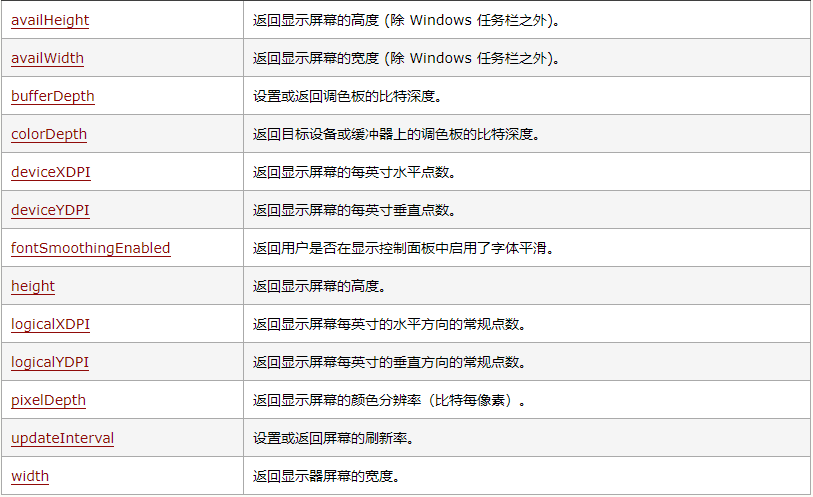

# BOM
  1. 理解window对象----BOM的核心
  2. 利用location对象中的页面信息
  3. 使用navigator对象了解浏览器

## window对象
**BOM的核心对象是window**，它表示浏览器的一个实例。在浏览器中，window对象有双重角色，它既是通过JavaScript访问浏览器窗口的一个接口，又是ECMAScript规定的Global对象。这意味着在网页中定义的任何一个对象、变量和函数，都以window作为其Global对象，因此有权访问parseInt()等方法。
### 全局作用域
由于window对象同时扮演者ECMAScript中Global对象的角色，因此所有在全局作用域中声明的变量、函数都会变成window对象的属性和方法。来看下面的例子。
```js
var age = 29;
function sayAge() {
  console.log(this.age);
};
console.log(window.age); // 29
sayAge(); // 29
window.sayAge(); // 29
```
我们在全局作用域中定义了一个变量age和一个函数sayAge()，它们被自动归在了window对象名下。可以通过window.age访问变量age，可以用过window.sayAge()访问函数sayAge()。由于sayAge()存在于全局作用域中，因此this.age被映射到window.age，最终显示的仍然是正确的结果。

抛开全局变量会成为window对象的属性不谈，定义全局变量与在window对象上直接定义属性还是有有一点差别：全局变量不能通过delete操作符删除，而直接在window对象上的定义的属性可以。例如：
```js
var age = 29;
window.color = "red";

delete window.age;

delete window.color;
console.log(window.age); // 29
console.log(window.color); // undefined
```
刚才使用var语句添加的window属性有一个名为[[Configurable(可配置)]]的特性，这个特性的值被设置为false，因此这样定义的属性不可以用过delete操作符删除。

另外，还要记住一件事：尝试访问未声明的变量会抛出错误，但是通过查询window对象，可以知道某个可能未声明的变量是否存在。例如：
```js
// 这里会抛出错误，因为oldValue未定义
var newValue = oldValue;

// 这里不会抛出错误，因为这是一次属性查询
// newValue的值是undefined
var newValue = window.oldValue;
console.log(newValue); // undefined
```
后面还会讲到很多全局JavaScript对象（如location和navigator）实际上都是window对象的属性。

### 窗口大小
**window.innerHeight和window.innerWidth**获取浏览器窗口大小。**document.documentElement.clientWidth和document.documentElement.clientHeight**也是一样的。
### 打开窗口
使用window.open()方法既可以导航到一个特定的URL，也可以打开一个新的浏览器窗口。这个方法可以接收4个参数：要加载的URL、窗口目标、一个特性字符串以及一个表示新页面是否取代浏览器历史记录中当前加载页面的布尔值。通常只须传递第一个参数就行了，最后一个参数只在不打开新窗口的情况下使用。
```js
window.open("https://www.baidu.com/");
// 关闭窗口使用window.close();
window.close();
```
### 间歇调用和超时调用
JavaScript是单线程语言，但它允许通过设置超时值和间歇时间值来调度代码在特定的时刻执行。前者是在指定的时间过后执行代码，而后者则是每隔指定的时间就执行一次代码。

超时调用需要使用window对象的setTimeout()方法，它接受两个参数：要执行的代码和以毫秒表示的时间（即在执行代码前需要等待多少毫秒）。其中，第一个参数可以是一个包含JavaScript代码的字符串（就和eval()函数中使用的字符串一样），也可以是一个函数。例如，下面对setTimeout()的两次调用都会在一秒中后显示一个警告框。
```js
// 不建议传递字符串！
setTimeout("alert('Hello world！')", 1000);

// 推荐的调用方式
setTimeout(function() {
  alert("Hello world!");
}, 1000);
```
第二个参数是一个表示等待多长时间的毫秒数，但经过该时间后指定的代码不一定执行。JavaScript是一个单线程的解释器，因此一定时间内只能执行一段代码。为了控制要执行的代码，就有一个JavaScript任务队列。这些任务会按照将它们添加到队列的顺序执行。setTimeout()的第二个参数告诉JavaScript再过多长时间把当前任务添加到队列中。如果队列是空的，那么添加的代码会立即执行；如果队列不是空的，那么它就要等前面的代码执行完了以后再执行。
:::warning 警告
虽然这两种调用方式都没有问题，但由于传递字符串可能导致性能损失，因此不建议以字符串作为第一个参数。
:::
调用setTimeout()之后，该方法会返回一个数值ID，表示超时调用。这个超时调用ID是计划执行代码的唯一标识符，可以通过它来取消超时调用。要取消尚未执行的超时调用计划，可以调用clearTimeout()方法并将相应的超时调用ID作为参数传递给它，如下所示。
```js
var timeoutId = setTimeout(function() {
  alert("Hello world！");
  // 也可以写在这里面
  // clearTimeout(timeoutId);
}, 1000);

// 注意：把它取消
clearTimeout(timeoutId);
```
只要是在指定的时间尚未过去之前调用clearTimeout()，就可以完全取消超时调用。前面的代码在设置超时调用之后马上又调用clearTimeout()，结果就跟什么也没有发生一样。

间歇调用与超时调用类似，只不过它会按照指定的时间间隔重复执行代码，直至间歇调用被取消或者页面被卸载。设置间歇调用的方法是setInterval()，它接受的参数与setTimeout()相同；要执行的代码（字符串或函数）和每次执行之前需要等待的毫秒数。下面来看一个例子。
```js
// 不建议传递字符串！
setInterval("console.log('Hello world')",1000);

// 推荐的调用方式
setInterval(function() {
  console.log("Hello world");
}, 1000);
```
调用setInterval()方法同样也会返回一个间歇调用ID，该ID可用于在将来某个时刻取消间歇调用。要取消尚未执行的间歇调用，可以使用clearInterval()方法并传入相应的间歇调用ID。取消时歇调用的重要性要远远高于取消超时调用，因为在不加干涉的情况下，间歇调用将会一直执行到页面卸载。以下是一个常见的使用间歇调用的例子。
```js
var num = 0;
var max = 10;
var intervalId = null;

function incrementNumber() {
  num++;
  // 如果执行次数达到了max设定的值，则取消后续尚未执行的调用
  if (num == max) {
    clearInterval(intervalId);
  }
}

intervalId = setInterval(incrementNumber, 500);
```
在这个例子中，变量num每半秒钟递增一次，当递增到最大值就会取消先前设定的间歇调用。这个模式也可以使用超时调用来实现。如下所示。
```js
var num = 0;
var max = 10;

function incrementNumber() {
  num++;
  // 如果执行次数达到了max设定的值，则设置另一次超时调用
  if (num < max) {
    setTimeout(incrementNumber, 500);
  } else {
    alert("Done");
  }
}

setTimeout(incrementNumber, 500);
```
可见，在使用超时调用时，没有必要跟踪超时调用ID，因为每次执行代码之后，如果不再设置另一次超时调用，调用就会自行停止。一般认为，使用超时调用来模拟间歇调用的是一种最佳模式。在开发环境下，很少使用真正的间歇调用，原因是后一个间歇调用可能会在前一个间歇调用结束之前启动。而像前面示例中那样使用超时调用，则完全可以避免这一点。所以，最好不要使用间歇调用。
### 系统对话框
浏览器通过**alert()、confirm()和prompt()方法可以调用系统对话框向用户显示消息**。系统对话框与在浏览器中显示的网页没有关系，也不包含HTML。它们的外观由操作系统及（或）浏览器设置决定，而不是由css决定。此外，通过这几个方法打开的对话框都是同步和模态的。也就是说，显示这些对话框的时候代码会停止执行，而关掉这些对话框后代码又会恢复执行。
## location对象
**location是最有用的BOM对象之一**，它提供了与当前窗口中加载的文档有关的信息，还提供了一些导航功能。事实上，location对象是很特别的一个对象，因为它既是window对象的属性，也是document对象的属性；换句话说，window.location和document.location引用的是同一个对象location对象的用处不只表现在它保存着当前文档的信息，还表现在它将URL解析为独立的片段，让开发人员可以通过不同的属性访问这些片段。下面列出了location对象的所有属性（注：省略了每个属性前面的location前缀）。
|属性名|例子|说明|
|----|----|----|
|hash|"#contents"|返回URL中的hash（#号后跟零活多个字符串）<br>如果URL中不包含散列，则返回空字符串|
|host|"www.baidu.com:80"|返回服务器名称和端口号（如果有）|
|hostname|"www.baidu.com"|返回不带端口号的服务器名称|
|href|"https://www.baidu.com"|返回当前加载页面的完整URL。而location对象<br>的toString()方法也返回这个值|
|pathname|"/WileyCDA/"|返回URL中的目录和（或）文件名|
|port|"8080"|返回URL中指定的端口号。如果URL中不包含端<br>口号，则这个属性返回空字符串|
|protocol|"http:"|返回页面使用的协议。通常是http:或https:|
|search|"?q=javascript"|返回URL的查询字符串。这个字符串以问号开头|
### 查询字符串参数
虽然通过上面的属性可以访问到location对象的大多数信息，但其中访问URL包含的查询字符串的属性并不方便。尽管location.search返回从问号到URL末尾的所有内容，但却没有办法逐个访问其中的每个查询字符串参数。为此，可以像下面这样创建一个函数，用以解析查询字符串，然后返回包含所有参数的一个对象：
```js
function getQueryStringArgs() {
  // 取得查询字符串并去掉开头的问号
  var qs = (location.search.length > 0 ? location.search.substring(1) : ""),

  // 保存数据的对象
  args = {},

  // 取得每一项
  items = qs.length ? qs.split("&") : [],
  item = null,
  name = null,
  value = null,

  // 在for循环中使用
  i = 0,
  len = items.length;

  // 逐个将每一项添加到args对象中
  for (i = 0; i < len; i++) {
    item = items[i].split("=");
    name = decodeURIComponent(item[0]);
    value = decodeURIComponent(item[1]);

    if (name.length) {
      args[name] = value;
    }
  }

  return args;
}
```
这个函数的第一步是先去掉查询字符串开头的问号。当然，前提是location.search中必须要包含一或多个字符。然后，所有参数将被保存在args对象中，该对象以字面量形式创建。接下来，根据和号（&）来分割查询字符串，并返回name=value格式的字符串数组。下面的for循环会迭代这个数组，然后再根据等于号分割每一项，从而返回第一项为参数名，第二项为参数值的数组。再使用decodeURIComponent()分别解码name和value（因为查询字符串应该是被编码过的）。最后，将name作为args对象的属性，将value作为相应属性的值。下面给出了使用这个函数的示例。
```js
// 假设查询字符串是?q=javascript&num=10
var args = getQueryStringArgs();
console.log(args["q"]); // javascript
console.log(args["num"]); // 10
```
可见，每个查询字符串参数都成了返回对象的属性。这样就极大地方便了对每个参数的访问。
### 位置操作
使用location对象可以通过很多方式来改变浏览器的位置。首先，也是最常用的方式，就是使用assign()方法并为其传递一个URL，如下所示。
```js
location.assign("https://www.baidu.com");
```
这样，就可以立即打开新URL并在浏览器的历史记录中生成一条记录。如果是将location.href或window.location设置一个URL值，也会以该值调用assign()方法。例如，下列两行代码与显式调用assign()方法的效果完全一样。
```js
  window.location = "https://www.baidu.com";
  location.href = "https://www.baidu.com";
```
在这些改变浏览器位置的方法中，最常用的是设置location.href属性。另外，修改location对象的其他属性也可以改变当前加载的页面。下面的例子展示了通过将**hash、search、hostname、pathname和port**属性设置为新值来改变URL。
```js
// 假设初始URL为http://www.baidu.com/WileyCDA/

// 将URL修改为"http://www.baidu.com/WileyCDA/#section1"
location.hash = "#section1";

// 将URL修改为"http://www.baidu.com/WileyCDA/?q=javascript"
location.search = "?q=javascript";

// 将URL修改为"http://www.yahoo.com/WileyCDA/"
location.hostname = "www.yahoo.com";

// 将URL修改为"http://www.yahoo.com/mydir/"
location.pathname = "mydir";

// 将URL修改为"http://www.yahoo.com:8080/WileyCDA/"
location.port = 8080;
```
每次修改location的属性（hash除外），页面都会以新URL重新加载。

当通过上述任何一种方式修改URL之后，浏览器的历史记录中就会生成一条新纪录，因此用户通过单击"后退"按钮都会导航到前一个页面。要禁用这种行为，可以使用**replace()方法**。这个方法只接受一个参数，即要导航到的URL；结果虽然会导致浏览器位置改变，但不会在历史记录中生成新记录。在调用replace()方法之后，用户不能回到前一个页面，来看下面的例子：
```js
setTimeout(function() {
  location.replace("https://www.baidu.com");
},1000);
```
如果将这个页面加载到浏览器中，浏览器就会在1秒钟后重新定向到www.baidu.com。然后，"后退"按钮将处于禁用状态，如果不重新输入完整的URL，则无法返回示例页面。

与位置有关的最后一个方法是**reload()**，作用是重新加载当前显示的页面。如果调用reload()时不传递任何参数，页面就会以最有效的方式重新加载。也就是说，如果页面上次请求以来并没有改变过，页面就会从浏览器缓存中重新加载。如果要强制从服务器重新加载，则需要像下面这样为该方法传递参数true。
```js
location.reload(); // 重新加载（有可能从缓存中加载）
location.reload(true); // 重新加载（从服务器重新加载）
```
位于reload()调用之后的代码可能会也可能不执行，这要取决于网络延迟或系统资源等因素。为此，最好将reload()放在代码的最后一行。
## navigator对象
navigator对象的属性通常用于检测显示网页的浏览器类型。下表列出navigator的属性。(图来自https://www.w3cschool.cn)

## screen对象
JavaScript中有几个对象在编程中用处不大，而screen对象就是其中之一。screen对象基本上只用来表明客户端的能力，其中包括浏览器窗口外部的显示器的信息，如像素宽度和高度等。每个浏览器中的screen对象都包含着各不相同的属性。下表列出了screen所有属性。(图来自https://www.w3cschool.cn)

涉及移动设备的屏幕大小时，情况有点不一样。运行ios的设备始终会像是把设备竖着拿在手里一样，因此返回的值是768x1024。而Android设备则会相应调用**screen.width和screen.height**的值。
## history对象
history对象保存着用户上网的历史记录，从窗口被打开的那一刻算起。因此history是window对象的属性，因此每个浏览器窗口、每个标签页乃至每个框架，都有自己的history对象与特定的window对象关联。出于安全方面的考虑，开发人员无法得知用户浏览过的URL。不过，借由用户访问过的页面列表，同样可以在不知道实际URL的情况下实现后退和前进。使用go()方法可以在用户的历史记录中任意跳转，可以向后也可以向前。这个方法接受一个参数，表示向后或向前跳转的页面数的一个整数值。负数表示向后跳转（类似于单击浏览器的“后退”按钮），正数表示向前跳转（类似于单击浏览器的“前进”按钮）。来看下面的例子。
```js
// 后退一页
history.go(-1);

// 前进一页
history.go(1);

// 前进两页
history.go(2);
```
也可以给go()方法传递一个字符串参数，此时浏览器会跳转到历史记录中包含该字符串的第一个位置--可能后退，也可能前进，具体要看哪个位置最近。如果历史记录中不包含该字符串，那么这个方法什么都不做，例如：
```js
// 跳转到最近的"baidu.com"页面
history.go("baidu.com");
```
另外，还可以使用两个简写方法back()和forward()来代替go()。顾名思义，这两个方法可以模仿浏览器的"后退"和"前进"按钮。
```js
// 后退一页
history.back();

// 前进一页
history.forward();
```
除了上述几个方法外：history对象还有一个length属性，保存着历史记录的数量。这个数量包含所有历史记录，即所有向后和向前的记录。对于加载到窗口、标签页或框架中的第一个页面而言，history.length等于0。通过像下面这样测试该属性的值，可以确定用户是否一开始就打开了你的页面。
```js
if (history.length == 0) {
  // 这应该是用户打开窗口后的第一个页面
}
```
虽然history并不常用，但在创建自定义的"后退"和"前进"按钮，以及检测当前页面是不是用户历史记录中的第一个页面时，还是必须使用它。
## 总结
浏览器对象模型(BOM)以window对象为委托，表示浏览器窗口以及页面可见区域。同时，window对象还是ECMAScript中的Global对象，
因而所有全局变量和函数都是它的属性，且所有原生的构造函数及其他函数也都存在于它的命名空间下。
  1. 使用location对象可以通过编程方式来访问浏览器的导航系统。设置相应的属性，可以逐段或整体性地修改浏览器的URL。
  2. 调用replace()方法可以导航到一个新URL，同时该URL会替换浏览器历史记录中当前显示的页面。
  3. navigator对象提供了与浏览器有关的信息。到底提供哪些信息，很大程度上取决于用户的浏览器；不过，也有一些公共的属性（如userAgent）存在于所有浏览器中。

BOM中还有两个对象：**screen和history**，但它们的功能有限。screen对象中保存着与客户端显示器有关的信息，这些信息一般只用于
站点分析。history对象为浏览器的历史记录开了一个小缝隙，开发人员可以据此判断历史记录的数量，也可以在历史记录中向后或向
前导航到任意页面。